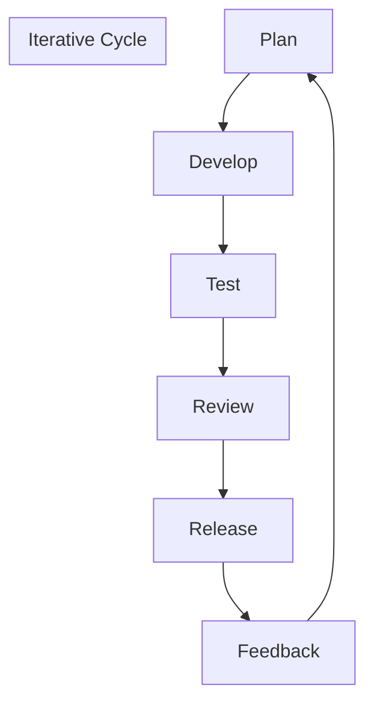
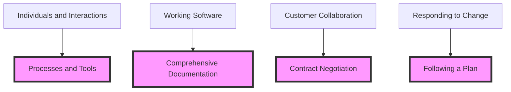
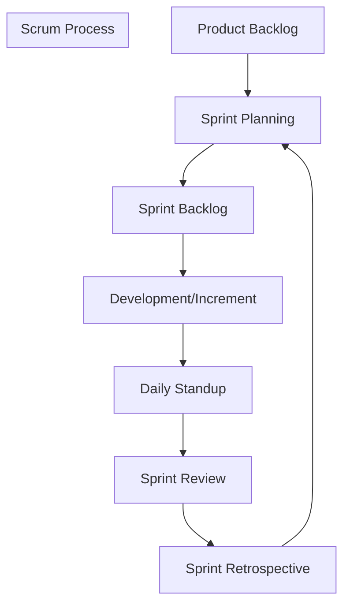
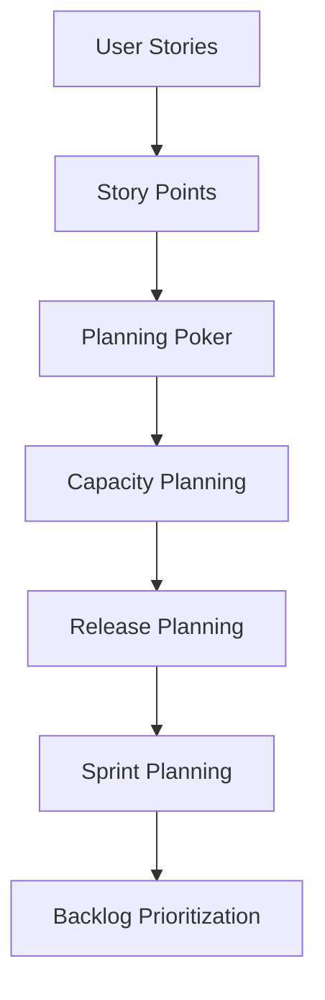
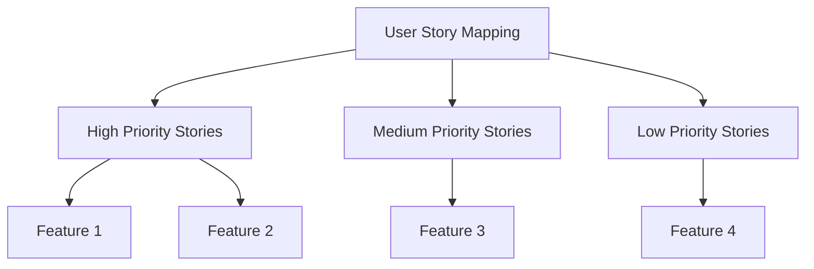
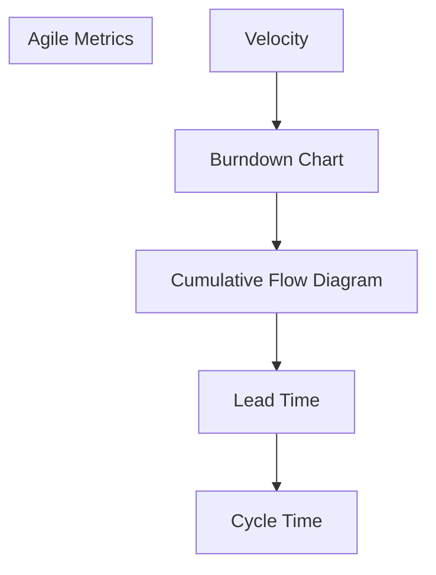

# Detailed Notes on Agile Development Topics

## 1. Introduction to Agile

### What is Agile?

Agile is a project management and software development methodology that prioritizes flexibility, collaboration, and customer satisfaction. It breaks down projects into smaller, manageable cycles called iterations or sprints, which are completed in a fixed timeframe. Agile emphasizes iterative development, where teams deliver small but functional pieces of a project and continuously improve based on feedback.

### Core Principles:
- **Customer Collaboration**: Direct involvement of stakeholders to ensure the product meets their expectations.
- **Iterative Development**: Frequent delivery of working software.
- **Adaptability**: Ability to adjust plans and processes in response to change.
- **Cross-Functional Teams**: Teams comprising members with diverse skills working together.
- **Continuous Improvement**: Retrospectives help teams refine their processes.

### Example:
Imagine a team building an e-commerce website. Instead of waiting months to launch the entire platform, they deliver functional parts incrementally:
1. Week 1-2: Basic product catalog functionality.
2. Week 3-4: Shopping cart and payment gateway.
3. Week 5-6: User reviews and recommendations.

---

## 2. Agile Manifesto

### What is the Agile Manifesto?
The Agile Manifesto is a set of guiding values and principles for Agile development, written in 2001 by a group of software developers. It emphasizes individuals and interactions over processes and tools, working software over comprehensive documentation, customer collaboration over contract negotiation, and responding to change over following a plan.

### Key Values:
1. **Individuals and Interactions**: Focus on collaboration and communication.
2. **Working Software**: Delivering value through functional software.
3. **Customer Collaboration**: Engaging customers to ensure their needs are met.
4. **Responding to Change**: Flexibility to adapt to new requirements.

### Principles:
- Deliver working software frequently.
- Welcome changing requirements.
- Build projects around motivated individuals.
- Foster continuous collaboration between business and technical teams.

### Example:
A development team prioritizes fixing a critical customer-reported issue over completing a pre-planned feature because it aligns with the value of customer collaboration and delivering working software.

---

## 3. Scrum Framework

### What is Scrum?

Scrum is one of the most popular Agile frameworks, focusing on delivering products in iterative cycles called sprints (typically 2-4 weeks). It provides a structured way to manage work and involves specific roles, ceremonies, and artifacts.

### Key Roles:
1. **Product Owner**: Defines the product vision and prioritizes the backlog.
2. **Scrum Master**: Facilitates the process and removes impediments.
3. **Development Team**: Delivers the product increment.

### Ceremonies:
- **Sprint Planning**: Sets the sprint goal and backlog items.
- **Daily Standup**: A short daily meeting to track progress.
- **Sprint Review**: Demonstrates the increment to stakeholders.
- **Sprint Retrospective**: Reflects on the sprint to identify improvements.

### Artifacts:
- **Product Backlog**: A prioritized list of work.
- **Sprint Backlog**: Tasks committed for the sprint.
- **Increment**: The completed work at the end of a sprint.

### Example:
A mobile app team develops a photo-sharing feature:
- Sprint 1: Build basic photo upload functionality.
- Sprint 2: Add filters and editing tools.
- Sprint 3: Enable sharing to social media.

---

## 4. Agile Estimation and Planning

### What is Agile Estimation?

Agile estimation involves predicting the effort required to complete user stories or tasks. It helps teams prioritize work and plan sprints effectively. Common techniques include:
- **Story Points**: Assigning points based on complexity and effort.
- **Planning Poker**: A collaborative estimation method using cards.
- **T-shirt Sizing**: Categorizing tasks into sizes like S, M, L, XL.

### Planning in Agile:
- **Release Planning**: High-level roadmap for delivering product features.
- **Sprint Planning**: Detailed plan for a specific sprint.

### Example:
A team estimates the effort for the following user stories using story points:
- User Registration: 3 points (simple).
- Social Media Integration: 8 points (complex).
- Report Generation: 5 points (medium complexity).

During sprint planning, they prioritize "User Registration" and "Report Generation" for a 2-week sprint.

---

## 5. Agile User Stories

### What are User Stories?
User stories are short, simple descriptions of a feature from the perspective of the end user. They follow the format:
*"As a [type of user], I want [feature or functionality] so that [benefit or reason]."*

### Characteristics of Good User Stories (INVEST):
- **Independent**: Can be developed separately.
- **Negotiable**: Scope can be adjusted.
- **Valuable**: Provides value to the user.
- **Estimable**: Can be estimated for effort.
- **Small**: Fits within a sprint.
- **Testable**: Can be verified through testing.

### Example:
User Story 1: 
*"As a shopper, I want to filter products by price so that I can find affordable items."*

User Story 2:
*"As an admin, I want to view analytics so that I can track user engagement."*

---

## 6. Agile Metrics and Reporting

### What are Agile Metrics?
Agile metrics measure the performance and progress of Agile teams. These metrics help identify bottlenecks, improve processes, and ensure timely delivery. Common metrics include:
1. **Velocity**: The number of story points completed in a sprint.
2. **Burndown Chart**: Tracks work remaining in a sprint.
3. **Cumulative Flow Diagram**: Visualizes work in progress, completed, and in the backlog.
4. **Lead Time**: Time taken from task initiation to completion.
5. **Cycle Time**: Time taken to complete a single task.

### Reporting in Agile:
Agile reports provide stakeholders with insights into progress and team performance. Common reports include sprint reviews, velocity charts, and release burndown charts.

### Example:
A team's velocity:
- Sprint 1: 20 story points.
- Sprint 2: 25 story points.
- Sprint 3: 30 story points.

The velocity trend helps the team plan future sprints more accurately.

# book a session with me

1. [calendly](https://calendly.com/jaycodingtutor/30min)

# hire and get to know me

find ways to hire me, follow me and stay in touch with me.

1. [github](https://github.com/Jay-study-nildana)
1. [personal site](https://thechalakas.com)
1. [upwork](https://www.upwork.com/fl/vijayasimhabr)
1. [fiverr](https://www.fiverr.com/jay_codeguy)
1. [codementor](https://www.codementor.io/@vijayasimhabr)
1. [stackoverflow](https://stackoverflow.com/users/5338888/jay)
1. [Jay's Coding Channel on YouTube](https://www.youtube.com/channel/UCJJVulg4J7POMdX0veuacXw/)
1. [medium blog](https://medium.com/@vijayasimhabr)
