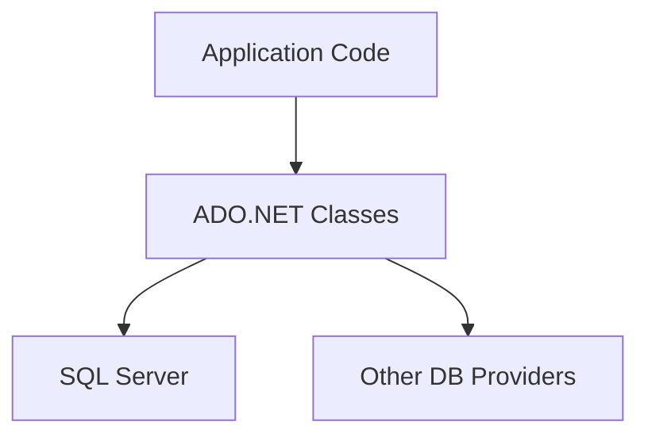
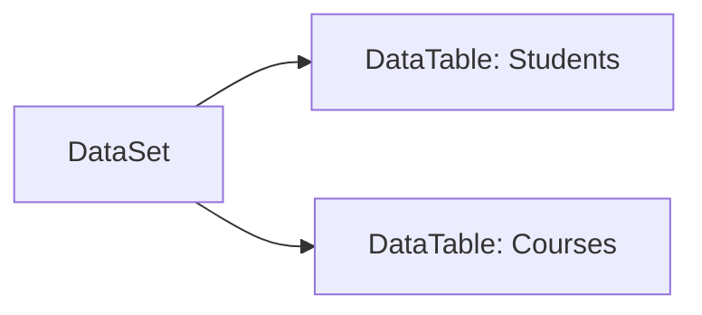
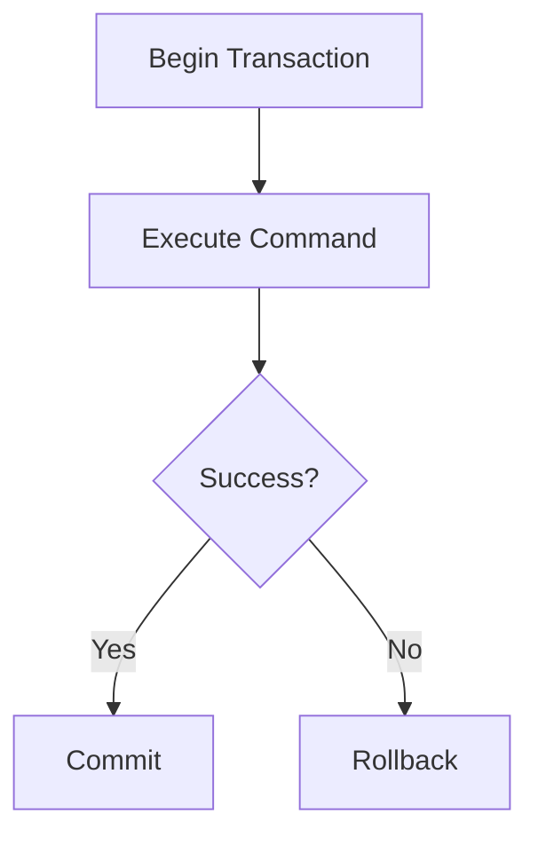

# General Topics Related to ADO.NET for Entry-Level Technical Interviews (Expanded)

This document provides a thorough overview of ADO.NET, including its architecture, components, code examples, diagrams, and practical scenarios to help entry-level developers prepare for technical interviews.

---

## Table of Contents

1. [Introduction to ADO.NET](#introduction-to-ado-net)
2. [ADO.NET Architecture](#ado-net-architecture)
3. [Key Components of ADO.NET](#key-components-of-ado-net)
4. [Establishing Database Connections](#establishing-database-connections)
5. [Executing SQL Commands](#executing-sql-commands)
6. [Using DataReaders vs. DataAdapters](#using-datareaders-vs-dataadapters)
7. [DataSet and DataTable](#dataset-and-datatable)
8. [Parameters and SQL Injection Prevention](#parameters-and-sql-injection-prevention)
9. [Transactions in ADO.NET](#transactions-in-ado-net)
10. [Error Handling and Exceptions](#error-handling-and-exceptions)
11. [Connecting to SQL Server](#connecting-to-sql-server)
12. [Best Practices and Common Pitfalls](#best-practices-and-common-pitfalls)
13. [Frequently Asked Interview Questions](#frequently-asked-interview-questions)
14. [Resources for Further Study](#resources-for-further-study)

---

## 1. Introduction to ADO.NET

**ADO.NET** is a set of classes in the .NET Framework for interacting with databases and other data sources. It provides low-level access to relational data and is the foundation for many higher-level data access technologies like Entity Framework.

### Key Features

- Fast, direct access to databases
- Works with disconnected and connected data models
- Supports multiple database providers (SQL Server, Oracle, etc.)

---

## 2. ADO.NET Architecture



**Explanation:**  
Application code uses ADO.NET classes to interact with databases through providers like `SqlClient` (for SQL Server).

---

## 3. Key Components of ADO.NET

| Component          | Purpose                                                          |
|--------------------|------------------------------------------------------------------|
| Connection         | Establishes connection to the database                           |
| Command            | Executes SQL statements or stored procedures                     |
| DataReader         | Reads data from the database in a forward-only, read-only manner |
| DataAdapter        | Transfers data between the database and DataSet                  |
| DataSet            | In-memory cache of data tables                                   |
| DataTable          | Represents a single table of in-memory data                      |
| Parameter          | Used for passing parameters to SQL commands                      |
| Transaction        | Supports database transactions                                   |

---

## 4. Establishing Database Connections

### Example: Connecting to SQL Server

```csharp
using System.Data.SqlClient;

string connectionString = "Server=.;Database=SchoolDB;Trusted_Connection=True;";
using (SqlConnection conn = new SqlConnection(connectionString))
{
    conn.Open();
    // Connection is now open
}
```

### Connection String Elements

- **Server**: SQL Server instance
- **Database**: Target database name
- **Trusted_Connection**: Uses Windows authentication

---

## 5. Executing SQL Commands

### Using SqlCommand

```csharp
using (SqlConnection conn = new SqlConnection(connectionString))
{
    conn.Open();
    string query = "INSERT INTO Students (Name, Age) VALUES (@name, @age)";
    using (SqlCommand cmd = new SqlCommand(query, conn))
    {
        cmd.Parameters.AddWithValue("@name", "Alice");
        cmd.Parameters.AddWithValue("@age", 20);
        cmd.ExecuteNonQuery();
    }
}
```

| Method             | Description                                   |
|--------------------|-----------------------------------------------|
| ExecuteNonQuery    | Executes statements without returning results |
| ExecuteScalar      | Returns a single value (first column, first row) |
| ExecuteReader      | Returns a DataReader for reading result sets  |

---

## 6. Using DataReaders vs. DataAdapters

| Feature         | DataReader              | DataAdapter/DataSet        |
|-----------------|------------------------|----------------------------|
| Connection      | Requires open connection| Can work disconnected      |
| Access          | Forward-only, read-only| Random access, editable    |
| Performance     | Fast, lightweight      | Slower, more memory usage  |
| Use Case        | Read large data quickly| Manipulate data in memory  |

### Example: Reading Data with DataReader

```csharp
string query = "SELECT Name, Age FROM Students";
using (SqlCommand cmd = new SqlCommand(query, conn))
using (SqlDataReader reader = cmd.ExecuteReader())
{
    while (reader.Read())
    {
        string name = reader.GetString(0);
        int age = reader.GetInt32(1);
    }
}
```

### Example: Filling DataSet with DataAdapter

```csharp
SqlDataAdapter adapter = new SqlDataAdapter("SELECT * FROM Students", conn);
DataSet ds = new DataSet();
adapter.Fill(ds, "Students");
```

---

## 7. DataSet and DataTable

- **DataSet**: In-memory representation of multiple tables and relations.
- **DataTable**: Represents a single table.

### Diagram



### Example

```csharp
DataSet ds = new DataSet();
DataTable dt = ds.Tables["Students"];
```

---

## 8. Parameters and SQL Injection Prevention

**Always use parameters to prevent SQL injection:**

```csharp
string query = "SELECT * FROM Students WHERE Name = @name";
using (SqlCommand cmd = new SqlCommand(query, conn))
{
    cmd.Parameters.AddWithValue("@name", userInput);
    using (SqlDataReader reader = cmd.ExecuteReader())
    {
        // Read results
    }
}
```

---

## 9. Transactions in ADO.NET

### Example

```csharp
using (SqlConnection conn = new SqlConnection(connectionString))
{
    conn.Open();
    SqlTransaction transaction = conn.BeginTransaction();
    try
    {
        SqlCommand cmd = conn.CreateCommand();
        cmd.Transaction = transaction;
        cmd.CommandText = "UPDATE Students SET Age = Age + 1 WHERE StudentID = 1";
        cmd.ExecuteNonQuery();

        transaction.Commit();
    }
    catch
    {
        transaction.Rollback();
    }
}
```

### Transaction Diagram



---

## 10. Error Handling and Exceptions

Use try-catch blocks to handle errors:

```csharp
try
{
    // ADO.NET operations
}
catch (SqlException ex)
{
    // Log or handle database errors
}
```

---

## 11. Connecting to SQL Server

- **Provider:** `System.Data.SqlClient` (classic), or `Microsoft.Data.SqlClient` (newer)
- **Connection String:** Use integrated security or SQL authentication

```csharp
string connectionString = "Server=myServer;Database=myDB;User Id=myUser;Password=myPass;";
```

---

## 12. Best Practices and Common Pitfalls

- Always close connections (use `using` statement)
- Use parameterized queries
- Handle exceptions gracefully
- Avoid hard-coding connection strings
- Use transactions for multiple related operations
- Prefer DataReader for performance in read-only scenarios
- Use DataAdapter/DataSet for disconnected data access

---

## 13. Frequently Asked Interview Questions

1. What is ADO.NET and why is it used?
2. Describe the difference between DataReader and DataAdapter.
3. How do you prevent SQL injection in ADO.NET?
4. What is the purpose of a DataSet?
5. How do you execute a stored procedure using ADO.NET?
6. Explain how transactions are managed in ADO.NET.
7. What are common exceptions encountered in ADO.NET?
8. How do you handle database connections efficiently?
9. What is the role of SqlParameter in commands?
10. Describe the steps to read data from a SQL Server table using ADO.NET.

---

## 14. Resources for Further Study

- [ADO.NET Documentation](https://learn.microsoft.com/en-us/dotnet/framework/data/adonet/)
- [SQL Server Data Access in .NET](https://learn.microsoft.com/en-us/dotnet/framework/data/adonet/sql/)
- [Best Practices for ADO.NET](https://learn.microsoft.com/en-us/dotnet/framework/data/adonet/best-practices)
- [ADO.NET Tutorial - TutorialsPoint](https://www.tutorialspoint.com/ado.net/index.htm)

---

> **Tip:** For interviews, be ready to write code snippets for connection, command execution, and data retrieval. Practice handling exceptions and transactions, and explain the difference between connected/disconnected models.

---

This expanded document is a master reference for ADO.NET interview preparation, including key concepts, diagrams, code samples, and best practices for entry-level roles.