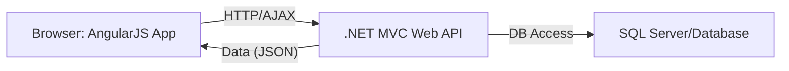
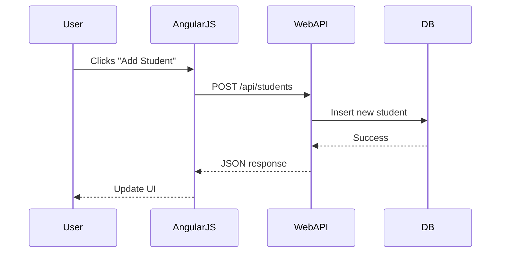
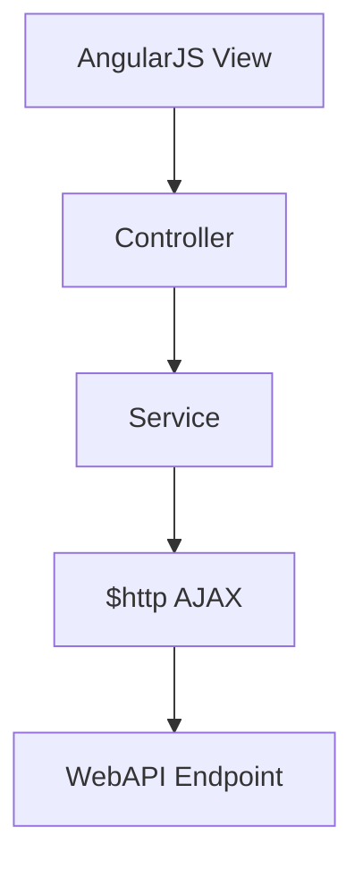

# General Topics Related to AngularJS with .NET MVC Web API Backend for Entry-Level Technical Interviews (Expanded)

This document provides a thorough overview of using AngularJS as a frontend framework with a .NET MVC Web API backend. It includes conceptual explanations, practical code samples, diagrams, integration scenarios, and common interview questions for entry-level developers.

---

## Table of Contents

1. [Introduction to AngularJS and .NET MVC Web API](#introduction-to-angularjs-and-net-mvc-web-api)
2. [Architecture Overview](#architecture-overview)
3. [Setting Up the .NET MVC Web API](#setting-up-the-net-mvc-web-api)
4. [Developing the AngularJS Frontend](#developing-the-angularjs-frontend)
5. [Client-Server Communication with HTTP](#client-server-communication-with-http)
6. [CRUD Operations Example](#crud-operations-example)
7. [Authentication and Security](#authentication-and-security)
8. [Common Integration Challenges](#common-integration-challenges)
9. [Testing and Debugging](#testing-and-debugging)
10. [Frequently Asked Interview Questions](#frequently-asked-interview-questions)
11. [Diagrams and Visual Summaries](#diagrams-and-visual-summaries)
12. [Resources for Further Study](#resources-for-further-study)

---

## 1. Introduction to AngularJS and .NET MVC Web API

- **AngularJS**: A powerful JavaScript framework for building single-page applications (SPAs). It provides data binding, dependency injection, and modular architecture.
- **.NET MVC Web API**: A backend framework for creating RESTful APIs using ASP.NET MVC, typically returning JSON data to client applications.

**Why Use Them Together?**
- Separation of concerns: UI logic in AngularJS, data/business logic in .NET Web API.
- Modern SPA architecture with scalable, maintainable backend.

---

## 2. Architecture Overview



**Explanation:**
- AngularJS runs in the user's browser, sending HTTP requests to the .NET Web API.
- Web API processes requests, interacts with the database, and returns JSON responses.

---

## 3. Setting Up the .NET MVC Web API

**Basic Steps:**
1. Create an ASP.NET Web API project.
2. Define Model classes, Controllers, and DbContext (if using Entity Framework).
3. Implement RESTful endpoints in controllers.

**Sample Controller:**
```csharp
[RoutePrefix("api/students")]
public class StudentsController : ApiController
{
    [HttpGet]
    [Route("")]
    public IEnumerable<Student> GetAll()
    {
        return db.Students.ToList();
    }

    [HttpPost]
    [Route("")]
    public IHttpActionResult Create(Student student)
    {
        db.Students.Add(student);
        db.SaveChanges();
        return Ok(student);
    }
}
```

---

## 4. Developing the AngularJS Frontend

**App Structure:**
- Module definition
- Controllers for UI logic
- Services for HTTP communication

**Sample AngularJS Module and Controller:**
```javascript
var app = angular.module('schoolApp', []);
app.controller('StudentController', function($scope, $http) {
    $scope.students = [];
    $http.get('/api/students')
        .then(function(response) {
            $scope.students = response.data;
        });
    $scope.addStudent = function(newStudent) {
        $http.post('/api/students', newStudent)
            .then(function(response) {
                $scope.students.push(response.data);
            });
    };
});
```

**View Example (HTML):**
```html
<div ng-controller="StudentController">
    <ul>
        <li ng-repeat="student in students">{{student.name}}</li>
    </ul>
    <input ng-model="newStudent.name" placeholder="Name">
    <button ng-click="addStudent(newStudent)">Add Student</button>
</div>
```

---

## 5. Client-Server Communication with HTTP

- AngularJS uses `$http` service for AJAX requests.
- Web API endpoints respond with JSON (default).
- Use HTTP verbs: GET, POST, PUT, DELETE for CRUD.

| AngularJS Method | HTTP Verb | Purpose                  |
|------------------|-----------|--------------------------|
| $http.get        | GET       | Fetch data               |
| $http.post       | POST      | Create data              |
| $http.put        | PUT       | Update data              |
| $http.delete     | DELETE    | Remove data              |

---

## 6. CRUD Operations Example

**Backend (C# Web API Controller):**
```csharp
[HttpPut]
[Route("{id}")]
public IHttpActionResult Update(int id, Student student)
{
    var existing = db.Students.Find(id);
    if (existing == null) return NotFound();
    existing.Name = student.Name;
    db.SaveChanges();
    return Ok(existing);
}
[HttpDelete]
[Route("{id}")]
public IHttpActionResult Delete(int id)
{
    var student = db.Students.Find(id);
    if (student == null) return NotFound();
    db.Students.Remove(student);
    db.SaveChanges();
    return Ok();
}
```

**Frontend (AngularJS Service Example):**
```javascript
app.service('StudentService', function($http){
    this.updateStudent = function(id, student){
        return $http.put('/api/students/' + id, student);
    };
    this.deleteStudent = function(id){
        return $http.delete('/api/students/' + id);
    };
});
```

---

## 7. Authentication and Security

- **Web API** can implement authentication (JWT, OAuth, or cookie-based).
- **AngularJS** stores tokens (JWT) for authenticated requests, sends them in `Authorization` header.
- **CORS (Cross-Origin Resource Sharing):** If frontend and backend are on different domains, enable CORS in Web API for AJAX.

**Sample JWT Token Usage:**
```javascript
$http.defaults.headers.common['Authorization'] = 'Bearer ' + token;
```
**Enable CORS in .NET Web API:**
```csharp
public static void Register(HttpConfiguration config)
{
    config.EnableCors();
}
```

---

## 8. Common Integration Challenges

| Challenge                | Solution                                   |
|--------------------------|--------------------------------------------|
| CORS errors              | Enable CORS in Web API                     |
| Serialization issues     | Ensure models are serializable             |
| Route mismatches         | Match frontend URLs to Web API endpoints   |
| Large payloads           | Use paging or filtering                    |
| Error handling           | Return meaningful errors from API, handle errors in AngularJS |

---

## 9. Testing and Debugging

- **Backend:** Use Postman or Swagger to test API endpoints.
- **Frontend:** Use browser DevTools for inspecting AJAX calls.
- **Unit Testing:** Jasmine/Karma for AngularJS, Xunit/NUnit for .NET.
- **Debugging:** Check network requests, error messages, and logs.

---

## 10. Frequently Asked Interview Questions

1. How does AngularJS communicate with a .NET Web API backend?
2. What is the role of MVC in .NET Web API?
3. How do you perform CRUD operations using AngularJS and Web API?
4. How is authentication handled between AngularJS and Web API?
5. What are common integration issues and how do you solve them?
6. Explain the use of services in AngularJS.
7. How do you handle errors in AJAX calls in AngularJS?
8. What is CORS and why is it important?
9. How do you structure a single-page application using AngularJS?
10. How do you test Web API endpoints?

---

## 11. Diagrams and Visual Summaries

### Full Stack Request Flow



### Component Interaction



---

## 12. Resources for Further Study

- [AngularJS Official Documentation](https://angularjs.org/)
- [ASP.NET Web API Documentation](https://learn.microsoft.com/en-us/aspnet/web-api/)
- [Microsoft Tutorial: Build a Web App with AngularJS and Web API](https://learn.microsoft.com/en-us/aspnet/web-api/overview/advanced/angularjs-in-web-api)
- [Postman API Testing Tool](https://www.postman.com/)
- [Swagger for Web API](https://swagger.io/)

---

> **Tip:** For interviews, be ready to write code for both frontend and backend, explain AJAX data flow, and troubleshoot integration issues. Practice setting up a small project and testing end-to-end communication.

---

This expanded document is a master reference for AngularJS and .NET MVC Web API integration interview preparation, including conceptual explanations, code samples, diagrams, and common questions for entry-level developers.