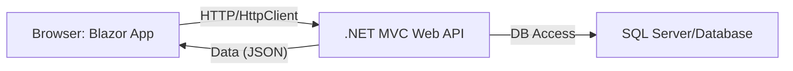
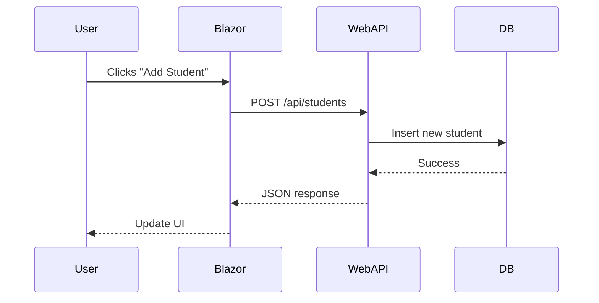

# General Topics Related to Blazor with .NET MVC Web API Backend for Entry-Level Technical Interviews (Expanded)

This document provides a comprehensive overview of using Blazor as a frontend framework with a .NET MVC Web API backend. It covers conceptual explanations, code samples, diagrams, integration scenarios, and common interview questions to help entry-level developers prepare for technical interviews.

---

## Table of Contents

1. [Introduction to Blazor and .NET MVC Web API](#introduction-to-blazor-and-net-mvc-web-api)
2. [Architecture Overview](#architecture-overview)
3. [Setting Up the .NET MVC Web API](#setting-up-the-net-mvc-web-api)
4. [Developing the Blazor Frontend](#developing-the-blazor-frontend)
5. [Client-Server Communication with HttpClient](#client-server-communication-with-httpclient)
6. [CRUD Operations Example](#crud-operations-example)
7. [Authentication and Security](#authentication-and-security)
8. [Common Integration Challenges](#common-integration-challenges)
9. [Testing and Debugging](#testing-and-debugging)
10. [Frequently Asked Interview Questions](#frequently-asked-interview-questions)
11. [Diagrams and Visual Summaries](#diagrams-and-visual-summaries)
12. [Resources for Further Study](#resources-for-further-study)

---

## 1. Introduction to Blazor and .NET MVC Web API

- **Blazor**: A modern .NET-based framework for building interactive web UIs using C#. Blazor WebAssembly runs client-side in the browser, while Blazor Server runs on the server using SignalR.
- **.NET MVC Web API**: A backend framework for creating RESTful APIs in ASP.NET MVC, typically returning JSON data for frontend applications.

**Why Use Them Together?**
- Enables full-stack .NET development using C# for both frontend and backend.
- Clean separation between UI and backend logic.
- Blazor can consume Web API endpoints for dynamic data.

---

## 2. Architecture Overview



**Explanation:**  
Blazor runs in the user's browser (WebAssembly) or on the server, sending HTTP requests to the .NET Web API.  
Web API processes requests, interacts with the database, and returns JSON responses.

---

## 3. Setting Up the .NET MVC Web API

**Basic Steps:**
1. Create an ASP.NET Web API project.
2. Define Model classes, Controllers, and DbContext (if using Entity Framework).
3. Implement RESTful endpoints in controllers.

**Sample Controller:**
```csharp
[RoutePrefix("api/students")]
public class StudentsController : ApiController
{
    [HttpGet]
    [Route("")]
    public IEnumerable<Student> GetAll()
    {
        return db.Students.ToList();
    }

    [HttpPost]
    [Route("")]
    public IHttpActionResult Create(Student student)
    {
        db.Students.Add(student);
        db.SaveChanges();
        return Ok(student);
    }
}
```

---

## 4. Developing the Blazor Frontend

**App Structure:**
- Pages (.razor files) for UI components.
- Services for API communication (using `HttpClient`).
- State management via dependency injection.

**Sample Blazor Component (StudentList.razor):**
```razor
@page "/students"
@inject HttpClient Http

<h2>Students</h2>
<ul>
    @foreach (var student in students)
    {
        <li>@student.Name</li>
    }
</ul>
<input @bind="newStudentName" placeholder="Name" />
<button @onclick="AddStudent">Add Student</button>

@code {
    List<Student> students = new List<Student>();
    string newStudentName;

    protected override async Task OnInitializedAsync()
    {
        students = await Http.GetFromJsonAsync<List<Student>>("/api/students");
    }

    async Task AddStudent()
    {
        var newStudent = new Student { Name = newStudentName };
        var response = await Http.PostAsJsonAsync("/api/students", newStudent);
        if (response.IsSuccessStatusCode)
        {
            var added = await response.Content.ReadFromJsonAsync<Student>();
            students.Add(added);
            newStudentName = string.Empty;
        }
    }
}
```

**Student Class Example:**
```csharp
public class Student
{
    public int StudentId { get; set; }
    public string Name { get; set; }
}
```

---

## 5. Client-Server Communication with HttpClient

- Blazor uses the `HttpClient` service for AJAX requests.
- Web API endpoints respond with JSON.
- Use HTTP verbs: GET, POST, PUT, DELETE for CRUD.

| Blazor Method                  | HTTP Verb | Purpose                  |
|--------------------------------|-----------|--------------------------|
| Http.GetFromJsonAsync<T>       | GET       | Fetch data               |
| Http.PostAsJsonAsync<T>        | POST      | Create data              |
| Http.PutAsJsonAsync<T>         | PUT       | Update data              |
| Http.DeleteAsync               | DELETE    | Remove data              |

---

## 6. CRUD Operations Example

**Backend (C# Web API Controller):**
```csharp
[HttpPut]
[Route("{id}")]
public IHttpActionResult Update(int id, Student student)
{
    var existing = db.Students.Find(id);
    if (existing == null) return NotFound();
    existing.Name = student.Name;
    db.SaveChanges();
    return Ok(existing);
}

[HttpDelete]
[Route("{id}")]
public IHttpActionResult Delete(int id)
{
    var student = db.Students.Find(id);
    if (student == null) return NotFound();
    db.Students.Remove(student);
    db.SaveChanges();
    return Ok();
}
```

**Frontend (Blazor Service Example):**
```csharp
public class StudentService
{
    private readonly HttpClient http;
    public StudentService(HttpClient httpClient) => http = httpClient;

    public async Task<List<Student>> GetStudentsAsync() =>
        await http.GetFromJsonAsync<List<Student>>("/api/students");

    public async Task<Student> AddStudentAsync(Student student)
    {
        var response = await http.PostAsJsonAsync("/api/students", student);
        return await response.Content.ReadFromJsonAsync<Student>();
    }

    public async Task UpdateStudentAsync(int id, Student student) =>
        await http.PutAsJsonAsync($"/api/students/{id}", student);

    public async Task DeleteStudentAsync(int id) =>
        await http.DeleteAsync($"/api/students/{id}");
}
```

---

## 7. Authentication and Security

- **Web API** can implement authentication (JWT, OAuth, cookie-based).
- **Blazor** stores tokens (JWT) in browser storage or protected session and sends them in the `Authorization` header when making requests.
- **CORS (Cross-Origin Resource Sharing):** Enable in Web API if Blazor is hosted on a different domain.

**Sample JWT Token Usage in Blazor:**
```csharp
http.DefaultRequestHeaders.Authorization =
    new AuthenticationHeaderValue("Bearer", token);
```

**Enable CORS in .NET Web API:**
```csharp
public static void Register(HttpConfiguration config)
{
    config.EnableCors();
}
```

---

## 8. Common Integration Challenges

| Challenge                | Solution                                   |
|--------------------------|--------------------------------------------|
| CORS errors              | Enable CORS in Web API                     |
| Serialization issues     | Ensure models are serializable             |
| Route mismatches         | Match frontend URLs to Web API endpoints   |
| Large payloads           | Use paging or filtering                    |
| Error handling           | Return meaningful errors from API, handle errors in Blazor |

---

## 9. Testing and Debugging

- **Backend:** Use Postman or Swagger to test API endpoints.
- **Frontend:** Use browser DevTools to inspect network requests.
- **Unit Testing:** xUnit/NUnit for .NET, bUnit for Blazor components.
- **Debugging:** Check network activity, error messages, and server logs.

---

## 10. Frequently Asked Interview Questions

1. How does Blazor communicate with a .NET MVC Web API backend?
2. What are the differences between Blazor Server and Blazor WebAssembly?
3. How do you perform CRUD operations using Blazor and Web API?
4. How is authentication handled between Blazor and Web API?
5. What are common integration issues and how do you solve them?
6. How do you manage state in Blazor?
7. How do you handle errors in HttpClient calls in Blazor?
8. What is CORS and why is it important?
9. How do you structure a Blazor application for maintainability?
10. How do you test Web API endpoints and Blazor components?

---

## 11. Diagrams and Visual Summaries

### Full Stack Request Flow



### Component Interaction

```mermaid
flowchart TD
    A[Blazor Component (.razor)] --> B[Service Class]
    B --> C[HttpClient AJAX]
    C --> D[WebAPI Endpoint]
```

---

## 12. Resources for Further Study

- [Blazor Documentation](https://learn.microsoft.com/en-us/aspnet/core/blazor/)
- [ASP.NET Web API Documentation](https://learn.microsoft.com/en-us/aspnet/web-api/)
- [Blazor WebAssembly vs Blazor Server](https://learn.microsoft.com/en-us/aspnet/core/blazor/hosting-models)
- [Postman API Testing Tool](https://www.postman.com/)
- [Swagger for Web API](https://swagger.io/)
- [bUnit for Blazor Testing](https://bunit.dev/)

---

> **Tip:** For interviews, be ready to write code for both frontend and backend, explain HttpClient data flow, handle authentication, and troubleshoot integration issues. Practice setting up a demo project to test end-to-end communication.

---

This expanded document is a master reference for Blazor and .NET MVC Web API integration interview preparation, including conceptual explanations, code samples, diagrams, and common questions for entry-level developers.