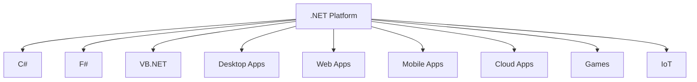
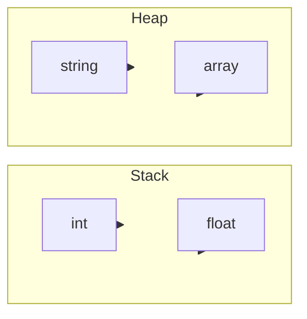
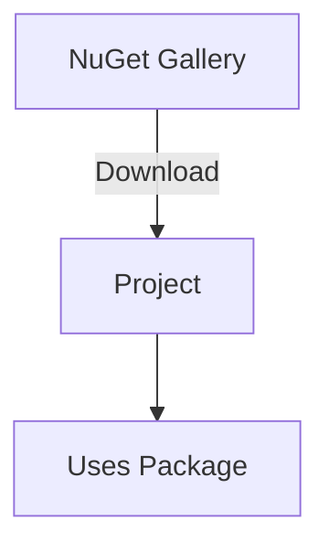
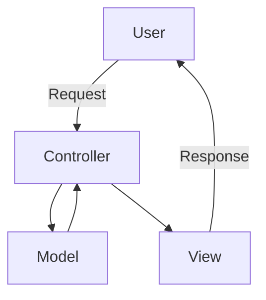
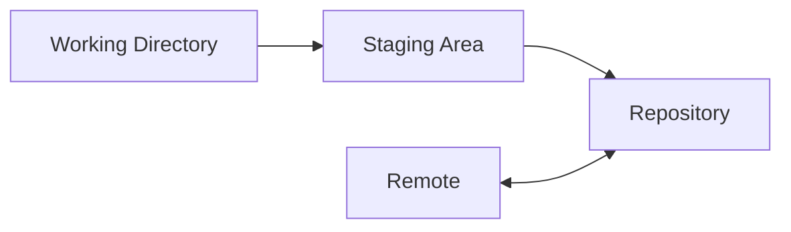
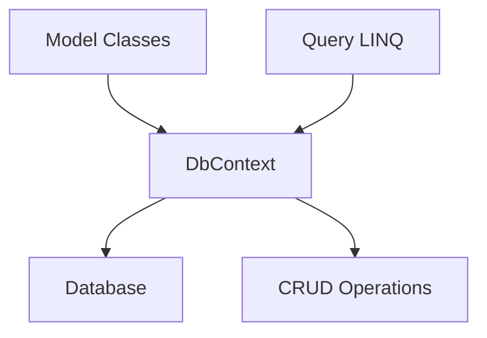

# General Topics Related to .NET and C# in Entry-Level Technical Interviews (Expanded)

This document provides a comprehensive, detailed overview of the most frequent .NET and C# topics encountered in entry-level developer interviews. It includes explanations, code snippets, charts, diagrams, and practical examples to enhance readability and understanding.

---

## Table of Contents

1. [Introduction to .NET](#introduction-to-net)
2. [C# Language Fundamentals](#c-language-fundamentals)
3. [Object-Oriented Programming (OOP) in C#](#object-oriented-programming-oop-in-c)
4. [Exception Handling](#exception-handling)
5. [Collections and Generics](#collections-and-generics)
6. [LINQ (Language Integrated Query)](#linq-language-integrated-query)
7. [Delegates, Events, and Lambda Expressions](#delegates-events-and-lambda-expressions)
8. [Asynchronous Programming](#asynchronous-programming)
9. [.NET Libraries and NuGet](#net-libraries-and-nuget)
10. [ASP.NET Fundamentals (Web Development)](#aspnet-fundamentals-web-development)
11. [Entity Framework Basics](#entity-framework-basics)
12. [Unit Testing and Best Practices](#unit-testing-and-best-practices)
13. [Source Control (Git)](#source-control-git)
14. [Coding Best Practices](#coding-best-practices)
15. [Frequently Asked Interview Questions](#frequently-asked-interview-questions)
16. [Resources for Further Study](#resources-for-further-study)

---

## 1. Introduction to .NET

### What is .NET?

.NET is a modern, open-source, cross-platform framework developed by Microsoft for building a wide variety of applications. It supports multiple programming languages (including C#, F#, and VB.NET) and offers a unified runtime for desktop, web, mobile, cloud, gaming, IoT, and more.

#### .NET Ecosystem Diagram



### .NET Core vs. .NET Framework vs. .NET 5/6/7+

| Feature                 | .NET Framework | .NET Core       | .NET 5/6/7+        |
|-------------------------|----------------|-----------------|--------------------|
| Platform Support        | Windows Only   | Cross-Platform  | Cross-Platform     |
| Open Source             | No             | Yes             | Yes                |
| Performance             | Good           | Better          | Best               |
| Latest Updates          | Legacy         | Active          | Primary Focus      |
| Application Types       | Desktop, Web   | Desktop, Web    | All (Unified)      |

**Key Point:** Modern development should use .NET 6/7+ for new projects.

---

## 2. C# Language Fundamentals

### Syntax and Code Structure

A simple C# program looks like:

```csharp
using System;

namespace HelloWorld
{
    class Program
    {
        static void Main(string[] args)
        {
            Console.WriteLine("Hello, World!");
        }
    }
}
```

### Data Types

#### Value vs. Reference Types

| Type           | Examples         | Stored In         | Characteristics             |
|----------------|------------------|-------------------|-----------------------------|
| Value Type     | int, float, bool | Stack             | Holds data directly         |
| Reference Type | string, array    | Heap              | Holds reference to data     |



### Variables and Constants

```csharp
int age = 25;           // variable
const double PI = 3.14; // constant
readonly int id;        // readonly field (can be initialized in constructor)
```

### Operators

- Arithmetic: `+`, `-`, `*`, `/`, `%`
- Comparison: `==`, `!=`, `<`, `>`, `<=`, `>=`
- Logical: `&&`, `||`, `!`
- Assignment: `=`, `+=`, `-=`, etc.

---

### Control Flow

```csharp
if (age > 18)
{
    Console.WriteLine("Adult");
}
else
{
    Console.WriteLine("Minor");
}

for (int i = 0; i < 5; i++)
{
    Console.WriteLine(i);
}
```

---

## 3. Object-Oriented Programming (OOP) in C#

OOP is one of the most important concepts for interviews. It includes:

- **Classes and Objects**
- **Inheritance**
- **Encapsulation**
- **Polymorphism**
- **Abstraction**

### Classes and Objects

```csharp
class Car
{
    public string Model { get; set; }
    public void Drive()
    {
        Console.WriteLine("Driving");
    }
}

Car myCar = new Car();
myCar.Model = "Tesla";
myCar.Drive();
```

### Inheritance

```csharp
class Animal
{
    public void Eat() { }
}

class Dog : Animal
{
    public void Bark() { }
}
```

### Encapsulation

Encapsulation hides internal details and exposes only necessary functionality.

```csharp
class BankAccount
{
    private decimal balance;
    public decimal Balance
    {
        get { return balance; }
        private set { balance = value; }
    }
}
```

### Polymorphism

Method Overloading:

```csharp
void Print(int i) { }
void Print(string s) { }
```

Method Overriding:

```csharp
class Base
{
    public virtual void Speak() { Console.WriteLine("Base"); }
}

class Derived : Base
{
    public override void Speak() { Console.WriteLine("Derived"); }
}
```

### Abstraction

Abstract classes and interfaces define contracts.

```csharp
abstract class Shape
{
    public abstract double Area();
}

interface IDrawable
{
    void Draw();
}
```

---

## 4. Exception Handling

Exception handling ensures application stability.

### Try-Catch-Finally

```csharp
try
{
    int x = 10 / 0; // throws DivideByZeroException
}
catch (DivideByZeroException ex)
{
    Console.WriteLine("Cannot divide by zero.");
}
finally
{
    Console.WriteLine("Cleanup code runs here.");
}
```

### Custom Exceptions

```csharp
class MyException : Exception
{
    public MyException(string message) : base(message) { }
}
```

---

## 5. Collections and Generics

### Collections

| Collection   | Description          | Example Usage                 |
|--------------|---------------------|-------------------------------|
| Array        | Fixed size           | `int[] nums = {1,2,3};`       |
| List         | Dynamic array        | `List<int> lst = new List<int>();` |
| Dictionary   | Key-value pairs      | `Dictionary<int, string>`      |
| Queue        | FIFO                | `Queue<int> q = new Queue<int>();` |
| Stack        | LIFO                | `Stack<int> s = new Stack<int>();` |

### Generics

Generics allow type-safe operations:

```csharp
List<string> names = new List<string>();
Dictionary<int, string> dict = new Dictionary<int, string>();
```

---

## 6. LINQ (Language Integrated Query)

LINQ allows querying collections with expressive syntax.

### Example

```csharp
List<int> numbers = new List<int> {1,2,3,4,5};
var evenNumbers = numbers.Where(n => n % 2 == 0).ToList();
```

### LINQ Query Syntax

```csharp
var query = from n in numbers
            where n % 2 == 0
            select n;
```

| Common LINQ Methods | Description           |
|---------------------|----------------------|
| Where               | Filters elements     |
| Select              | Projects each element|
| OrderBy             | Sorts elements      |
| GroupBy             | Groups elements     |
| Join                | Joins collections   |

---

## 7. Delegates, Events, and Lambda Expressions

### Delegates

A delegate is a reference type for methods.

```csharp
delegate void Notify(string message);

void Send(string msg) { Console.WriteLine(msg); }

Notify notifier = Send;
notifier("Hello!");
```

### Events

Events use delegates to provide notifications.

```csharp
class Publisher
{
    public event Notify OnNotify;
}
```

### Lambda Expressions

Short-hand functions:

```csharp
Func<int, int, int> add = (a, b) => a + b;
```

---

## 8. Asynchronous Programming

### Async/Await

Async programming avoids blocking the main thread.

```csharp
async Task<int> GetDataAsync()
{
    await Task.Delay(1000);
    return 42;
}
```

### Tasks

```csharp
Task.Run(() => Console.WriteLine("Running in parallel"));
```

| Keyword | Purpose                          |
|---------|----------------------------------|
| async   | Marks method as asynchronous     |
| await   | Waits for async operation        |
| Task    | Represents async operation       |

---

## 9. .NET Libraries and NuGet

### .NET Standard Libraries

- System
- System.Collections
- System.IO
- System.Linq

### NuGet

NuGet is the package manager for .NET.

```shell
dotnet add package Newtonsoft.Json
```

NuGet diagram:



---

## 10. ASP.NET Fundamentals (Web Development)

ASP.NET enables web development in .NET.

### MVC Pattern

- **Model:** Data and business logic
- **View:** UI
- **Controller:** Request handling

MVC Diagram:



### Routing Example

```csharp
// Route: /Home/Index
public class HomeController : Controller
{
    public IActionResult Index()
    {
        return View();
    }
}
```

### Web API Basics

```csharp
[ApiController]
[Route("api/[controller]")]
public class ProductsController : ControllerBase
{
    [HttpGet]
    public IEnumerable<Product> GetProducts() { ... }
}
```

---

## 11. Entity Framework Basics

Entity Framework (EF) is an ORM for .NET.

### Code First Approach

```csharp
public class Student
{
    public int Id { get; set; }
    public string Name { get; set; }
}

public class SchoolContext : DbContext
{
    public DbSet<Student> Students { get; set; }
}
```

### Database First Approach

You generate models from an existing database.

### CRUD Operations

```csharp
// Create
db.Students.Add(new Student { Name = "John" });
db.SaveChanges();

// Read
var students = db.Students.ToList();

// Update
var student = db.Students.First();
student.Name = "Jane";
db.SaveChanges();

// Delete
db.Students.Remove(student);
db.SaveChanges();
```

---

## 12. Unit Testing and Best Practices

### Unit Testing Frameworks

- MSTest
- NUnit
- xUnit

### Example Test

```csharp
[TestMethod]
public void Add_ShouldReturnSum()
{
    Assert.AreEqual(4, Add(2, 2));
}
```

### Mocking

Mocking isolates tests from dependencies.

---

## 13. Source Control (Git)

Git is essential for modern development.

### Common Commands

| Command           | Description                  |
|-------------------|-----------------------------|
| `git clone`       | Clone a repository          |
| `git add`         | Stage changes               |
| `git commit`      | Commit changes              |
| `git push`        | Push to remote              |
| `git pull`        | Fetch and merge remote      |
| `git branch`      | Manage branches             |
| `git merge`       | Merge branches              |

### Git Workflow Diagram



---

## 14. Coding Best Practices

### Naming Conventions

- Classes: `PascalCase` (e.g., `Student`)
- Methods: `PascalCase` (e.g., `GetName`)
- Variables: `camelCase` (e.g., `studentName`)
- Constants: `ALL_CAPS` (e.g., `MAX_SIZE`)

### Code Readability

- Use comments for clarification
- Organize code logically
- Avoid large methods

### DRY Principle

"Don't Repeat Yourself" - reuse code where possible.

### Error Handling

- Handle exceptions gracefully
- Use logging frameworks

---

## 15. Frequently Asked Interview Questions

1. **What is the difference between value types and reference types in C#?**
   - Value types are stored on the stack and contain the actual data. Reference types are stored on the heap and hold a reference to the data.

2. **Explain the concept of garbage collection in .NET.**
   - Automatic memory management. The .NET runtime frees unused objects, reducing memory leaks.

3. **What is an interface and how is it different from an abstract class?**
   - Interface defines a contract; abstract class can provide base implementation.

4. **How does async/await improve application performance?**
   - Prevents blocking threads, enabling responsive UI and efficient I/O operations.

5. **How do you handle exceptions in C#?**
   - Using try-catch-finally blocks.

6. **What is dependency injection?**
   - Technique to achieve loosely coupled code by passing dependencies via constructors or properties.

7. **What are delegates and events?**
   - Delegates reference methods; events use delegates for notifications.

8. **Explain the MVC pattern in ASP.NET.**
   - Separates application into Model, View, Controller for maintainability.

9. **How do you query data using LINQ?**
   - Use LINQ methods or query syntax for expressive queries.

10. **What is Entity Framework and why is it used?**
    - ORM for .NET, simplifies database operations.

---

## 16. Resources for Further Study

- [Microsoft Learn: .NET](https://learn.microsoft.com/en-us/dotnet/)
- [C# Documentation](https://learn.microsoft.com/en-us/dotnet/csharp/)
- [ASP.NET Documentation](https://learn.microsoft.com/en-us/aspnet/core/)
- [Entity Framework Documentation](https://learn.microsoft.com/en-us/ef/)
- [Git Documentation](https://git-scm.com/doc)
- [NuGet Documentation](https://learn.microsoft.com/en-us/nuget/)

---

## Appendix: Additional Diagrams

### OOP Principles Venn Diagram

```mermaid
venn
    title OOP Principles
    Encapsulation
    Inheritance
    Polymorphism
    Abstraction
    Encapsulation & Inheritance
    Inheritance & Polymorphism
    Polymorphism & Abstraction
    Encapsulation & Polymorphism
    Encapsulation & Abstraction
```

### Entity Framework Workflow



---

> **Tip:** For interviews, be ready to write code, draw diagrams, and explain concepts clearly. Practice by building small projects, writing unit tests, and reviewing sample questions.

---

This expanded document is designed to be a master reference for .NET and C# interview preparation. It covers deep conceptual and practical aspects essential for entry-level developer roles, with diagrams and charts for enhanced learning.