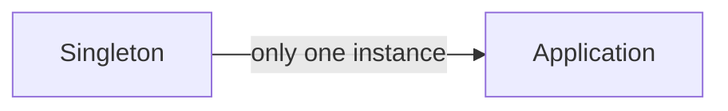
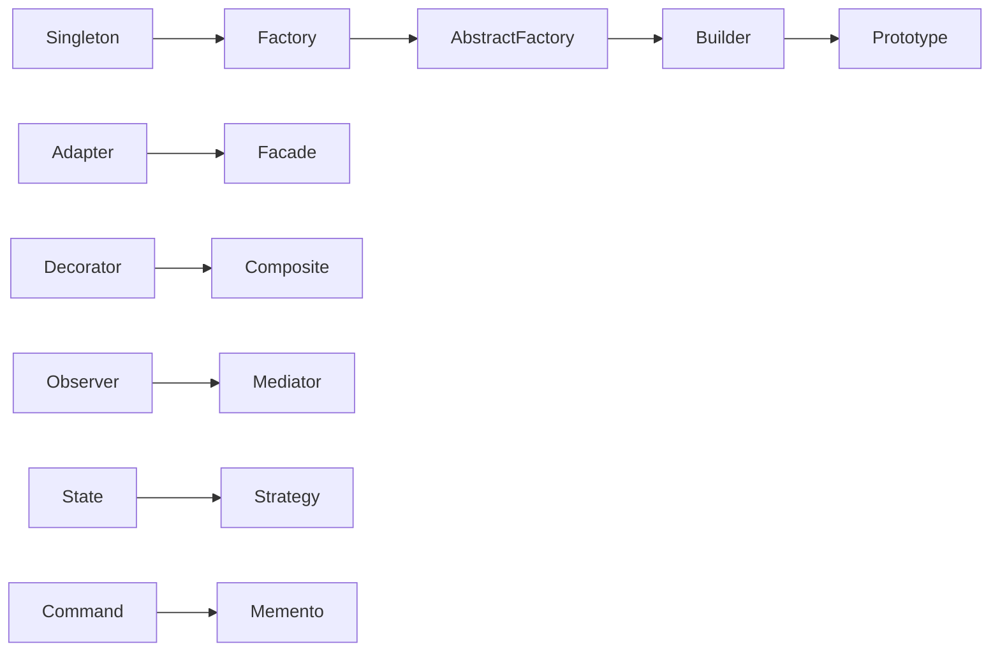
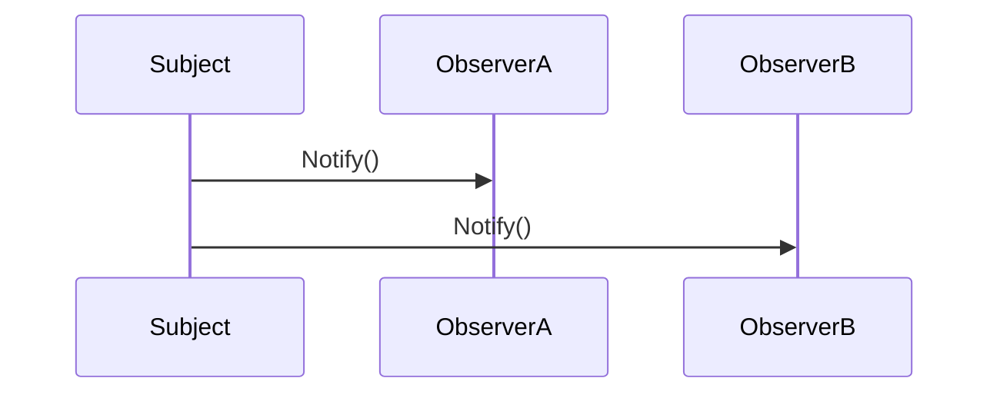

# General Topics Related to Design Patterns for Entry-Level Technical Interviews (Expanded)

This document provides a detailed overview of common software design patterns, including explanations, real-world analogies, code examples, diagrams, and interview questions to help entry-level developers prepare for technical interviews.

---

## Table of Contents

1. [Introduction to Design Patterns](#introduction-to-design-patterns)
2. [Creational Patterns](#creational-patterns)
    - Singleton
    - Factory Method
    - Abstract Factory
    - Builder
    - Prototype
3. [Structural Patterns](#structural-patterns)
    - Adapter
    - Bridge
    - Composite
    - Decorator
    - Facade
    - Flyweight
    - Proxy
4. [Behavioral Patterns](#behavioral-patterns)
    - Chain of Responsibility
    - Command
    - Interpreter
    - Iterator
    - Mediator
    - Memento
    - Observer
    - State
    - Strategy
    - Template Method
    - Visitor
5. [Choosing the Right Pattern](#choosing-the-right-pattern)
6. [Common Interview Questions](#common-interview-questions)
7. [Diagrams and Visual Summaries](#diagrams-and-visual-summaries)
8. [Resources for Further Study](#resources-for-further-study)

---

## 1. Introduction to Design Patterns

**Definition:**  
Design patterns are reusable solutions to common problems in software design. They provide templates for writing code that is flexible, maintainable, and scalable.

**Benefits:**
- Standardizes solutions
- Improves communication among developers
- Encourages best practices

---

## 2. Creational Patterns

### Singleton

**Purpose:** Ensure a class has only one instance and provide a global point of access.

```csharp
public class Singleton
{
    private static Singleton instance;
    private Singleton() { }
    public static Singleton Instance
    {
        get
        {
            if (instance == null)
                instance = new Singleton();
            return instance;
        }
    }
}
```

**Diagram:**


---

### Factory Method

**Purpose:** Define an interface for creating an object, but let subclasses decide which class to instantiate.

```csharp
public abstract class Animal
{
    public abstract string Speak();
}

public class Dog : Animal
{
    public override string Speak() => "Woof";
}

public class AnimalFactory
{
    public static Animal CreateAnimal(string type)
    {
        if (type == "Dog") return new Dog();
        // Add other types...
        return null;
    }
}
```

---

### Abstract Factory

**Purpose:** Provide an interface for creating families of related or dependent objects.

```csharp
public interface IButton { void Render(); }
public interface ICheckbox { void Render(); }

public class WindowsButton : IButton { /*...*/ }
public class MacButton : IButton { /*...*/ }

public interface IUIFactory
{
    IButton CreateButton();
    ICheckbox CreateCheckbox();
}
```

---

### Builder

**Purpose:** Separate the construction of a complex object from its representation.

```csharp
public class PizzaBuilder
{
    private Pizza pizza = new Pizza();
    public PizzaBuilder AddCheese() { /*...*/ return this; }
    public PizzaBuilder AddTomato() { /*...*/ return this; }
    public Pizza Build() => pizza;
}
```

---

### Prototype

**Purpose:** Create new objects by copying an existing object (the prototype).

```csharp
public class Document : ICloneable
{
    public string Text;
    public object Clone() => this.MemberwiseClone();
}
```

---

## 3. Structural Patterns

### Adapter

**Purpose:** Convert the interface of a class into another interface clients expect.

```csharp
public interface ITarget { void Request(); }
public class Adaptee { public void SpecificRequest() { } }
public class Adapter : ITarget
{
    private Adaptee adaptee = new Adaptee();
    public void Request() => adaptee.SpecificRequest();
}
```

---

### Bridge

**Purpose:** Decouple an abstraction from its implementation.

```csharp
public interface IDrawer { void DrawCircle(int x, int y, int r); }
public class RedDrawer : IDrawer { /*...*/ }
public class Circle
{
    private IDrawer drawer;
    public Circle(IDrawer drawer) { this.drawer = drawer; }
    public void Draw() { drawer.DrawCircle(1,2,3); }
}
```

---

### Composite

**Purpose:** Compose objects into tree structures to represent part-whole hierarchies.

```csharp
public interface IComponent { void Operation(); }
public class Leaf : IComponent { /*...*/ }
public class Composite : IComponent
{
    private List<IComponent> children = new List<IComponent>();
    public void Operation()
    {
        foreach(var child in children)
            child.Operation();
    }
}
```

---

### Decorator

**Purpose:** Add responsibilities to objects dynamically.

```csharp
public interface ICoffee { string GetDescription(); }
public class SimpleCoffee : ICoffee { /*...*/ }
public class MilkDecorator : ICoffee
{
    private ICoffee coffee;
    public MilkDecorator(ICoffee coffee) { this.coffee = coffee; }
    public string GetDescription() => coffee.GetDescription() + ", Milk";
}
```

---

### Facade

**Purpose:** Provide a simplified interface to a complex system.

```csharp
public class CarFacade
{
    public void StartCar()
    {
        // Start engine, check fuel, etc.
    }
}
```

---

### Flyweight

**Purpose:** Minimize memory usage by sharing as much data as possible.

```csharp
public class FlyweightFactory
{
    private Dictionary<string, Flyweight> flyweights = new();
    public Flyweight Get(string key)
    {
        if (!flyweights.ContainsKey(key))
            flyweights[key] = new Flyweight();
        return flyweights[key];
    }
}
```

---

### Proxy

**Purpose:** Provide a surrogate or placeholder for another object.

```csharp
public interface IService { void Request(); }
public class RealService : IService { /*...*/ }
public class ProxyService : IService
{
    private RealService realService = new RealService();
    public void Request() { /* Access control, then ... */ realService.Request(); }
}
```

---

## 4. Behavioral Patterns

### Chain of Responsibility

**Purpose:** Pass requests along a chain of handlers.

```csharp
public abstract class Handler
{
    protected Handler next;
    public void SetNext(Handler handler) => next = handler;
    public abstract void Handle(Request req);
}
```

---

### Command

**Purpose:** Encapsulate a request as an object.

```csharp
public interface ICommand { void Execute(); }
public class LightOnCommand : ICommand { /*...*/ }
public class RemoteControl
{
    public void SetCommand(ICommand cmd) { /*...*/ }
}
```

---

### Interpreter

**Purpose:** Define a grammar for interpreting sentences.

```csharp
public interface IExpression { int Interpret(); }
public class Number : IExpression { /*...*/ }
```

---

### Iterator

**Purpose:** Provide a way to access elements of a collection sequentially.

```csharp
public interface IIterator<T> { bool HasNext(); T Next(); }
```

---

### Mediator

**Purpose:** Define an object that encapsulates how a set of objects interact.

```csharp
public interface IMediator { void Notify(object sender, string ev); }
```

---

### Memento

**Purpose:** Capture and restore the object's state.

```csharp
public class Memento { /*...*/ }
public class Originator { /*...*/ }
```

---

### Observer

**Purpose:** Define a dependency between objects so that one changes, all dependents are notified.

```csharp
public interface IObserver { void Update(); }
public class Subject
{
    private List<IObserver> observers = new List<IObserver>();
    public void Attach(IObserver observer) { observers.Add(observer); }
    public void Notify() { foreach(var o in observers) o.Update(); }
}
```

---

### State

**Purpose:** Allow an object to alter its behavior when its internal state changes.

```csharp
public interface IState { void Handle(); }
public class Context
{
    private IState state;
    public void SetState(IState s) { state = s; }
    public void Request() { state.Handle(); }
}
```

---

### Strategy

**Purpose:** Define a family of algorithms, encapsulate each one, and make them interchangeable.

```csharp
public interface IStrategy { void Execute(); }
public class ConcreteStrategyA : IStrategy { /*...*/ }
public class Context
{
    private IStrategy strategy;
    public void SetStrategy(IStrategy s) { strategy = s; }
}
```

---

### Template Method

**Purpose:** Define the skeleton of an algorithm, letting subclasses override steps.

```csharp
public abstract class DataProcessor
{
    public void Process()
    {
        ReadData();
        ProcessData();
        SaveData();
    }
    protected abstract void ReadData();
    protected abstract void ProcessData();
    protected abstract void SaveData();
}
```

---

### Visitor

**Purpose:** Represent an operation to be performed on elements of an object structure.

```csharp
public interface IVisitor { void Visit(Element element); }
public class Element
{
    public void Accept(IVisitor visitor) { visitor.Visit(this); }
}
```

---

## 5. Choosing the Right Pattern

| Problem/Scenario                  | Recommended Pattern      |
|-----------------------------------|-------------------------|
| Only one instance needed          | Singleton               |
| Families of related objects       | Abstract Factory        |
| Adding behaviors dynamically      | Decorator               |
| Centralizing complex operations   | Facade                  |
| Event notification                | Observer                |
| Interchangeable algorithms        | Strategy                |
| Iterating over collections        | Iterator                |
| Access control                    | Proxy                   |
| Undo/Redo functionality           | Memento                 |

---

## 6. Common Interview Questions

1. What is a design pattern and why are they important?
2. Can you name three creational patterns and explain their differences?
3. How does the Singleton pattern ensure only one instance?
4. Explain the difference between Adapter and Facade.
5. When would you use the Observer pattern?
6. How does the Strategy pattern promote flexibility?
7. Give an example of the Command pattern in a real application.
8. What is the purpose of the Template Method pattern?
9. How can the Proxy pattern be used for security?
10. Describe a scenario where you refactored code using a design pattern.

---

## 7. Diagrams and Visual Summaries

### Pattern Relationships



### Observer Pattern Interaction



---

## 8. Resources for Further Study

- [Head First Design Patterns](https://www.oreilly.com/library/view/head-first-design/0596007124/)
- [Refactoring Guru: Design Patterns](https://refactoring.guru/design-patterns)
- [Microsoft Docs: Design Patterns](https://learn.microsoft.com/en-us/dotnet/architecture/modern-web-apps-azure/common-web-application-architectures#design-patterns)
- [DoFactory Patterns](https://www.dofactory.com/net/design-patterns)

---

> **Tip:** For interviews, be prepared to explain the intent of each pattern, recognize code examples, and discuss trade-offs. Practice refactoring sample code using patterns and drawing simple diagrams to illustrate your design.

---

This expanded document is a master reference for design patterns interview preparation, including explanations, code samples, diagrams, and common questions for entry-level developers.