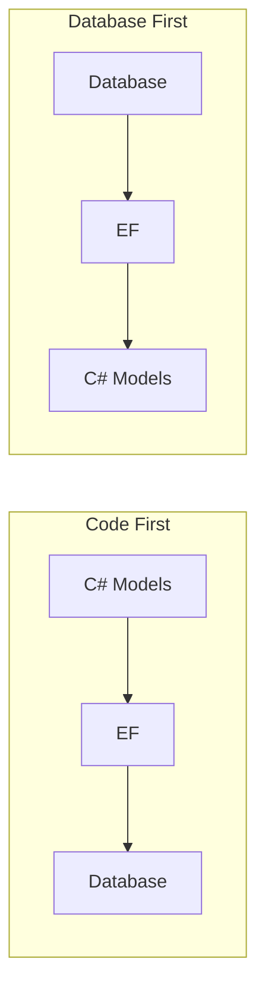
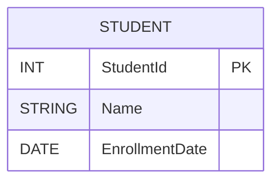
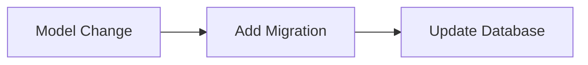

# General Topics Related to Entity Framework with Microsoft SQL Server for Entry-Level Technical Interviews (Expanded)

This document provides a detailed overview of Entity Framework (EF) as used with Microsoft SQL Server, covering concepts, code examples, diagrams, and practical scenarios relevant for entry-level developer interviews.

---

## Table of Contents

1. [Introduction to Entity Framework](#introduction-to-entity-framework)
2. [Entity Framework Architecture](#entity-framework-architecture)
3. [EF Approaches: Code First vs. Database First](#ef-approaches-code-first-vs-database-first)
4. [Setting Up EF in a .NET Project](#setting-up-ef-in-a-net-project)
5. [Defining Models and DbContext](#defining-models-and-dbcontext)
6. [Database Migrations](#database-migrations)
7. [CRUD Operations with EF](#crud-operations-with-ef)
8. [LINQ Queries in EF](#linq-queries-in-ef)
9. [Relationships: One-to-One, One-to-Many, Many-to-Many](#relationships-one-to-one-one-to-many-many-to-many)
10. [Eager, Lazy, and Explicit Loading](#eager-lazy-and-explicit-loading)
11. [Stored Procedures with EF](#stored-procedures-with-ef)
12. [EF Core vs. EF 6](#ef-core-vs-ef-6)
13. [Performance Tips and Common Pitfalls](#performance-tips-and-common-pitfalls)
14. [Frequently Asked Interview Questions](#frequently-asked-interview-questions)
15. [Resources for Further Study](#resources-for-further-study)

---

## 1. Introduction to Entity Framework

**Entity Framework** is an Object-Relational Mapper (ORM) for .NET, allowing developers to interact with databases using .NET objects rather than direct SQL queries. EF supports Microsoft SQL Server and other relational databases.

### Key Features

- Automated database CRUD operations
- LINQ querying for data access
- Supports Code First, Database First, and Model First approaches
- Handles relationships and constraints

---

## 2. Entity Framework Architecture

```mermaid
flowchart TD
    A[App Code (C#)] --> B[Entity Framework ORM]
    B --> C[SQL Queries]
    C --> D[SQL Server Database]
```

**Explanation:**  
Your C# code interacts with the EF ORM, which translates operations into SQL queries executed by SQL Server.

---

## 3. EF Approaches: Code First vs. Database First

| Approach      | Description              | Use Case                       |
|---------------|-------------------------|--------------------------------|
| Code First    | Define models in code, EF creates DB | New projects, test-driven dev  |
| Database First| Start with existing DB, EF generates models | Legacy DB, integration         |

**Diagram:**



---

## 4. Setting Up EF in a .NET Project

1. **Install EF NuGet Package**
   ```
   dotnet add package Microsoft.EntityFrameworkCore.SqlServer
   ```

2. **Configure Connection String in `appsettings.json`**
   ```json
   {
     "ConnectionStrings": {
       "DefaultConnection": "Server=.;Database=SchoolDB;Trusted_Connection=True;"
     }
   }
   ```

3. **Register DbContext in `Startup.cs` or `Program.cs`**
   ```csharp
   services.AddDbContext<SchoolContext>(options =>
       options.UseSqlServer(Configuration.GetConnectionString("DefaultConnection")));
   ```

---

## 5. Defining Models and DbContext

### Example Model

```csharp
public class Student
{
    public int StudentId { get; set; }
    public string Name { get; set; }
    public DateTime EnrollmentDate { get; set; }
}
```

### DbContext

```csharp
public class SchoolContext : DbContext
{
    public DbSet<Student> Students { get; set; }
}
```

**Diagram:**



---

## 6. Database Migrations

**Migrations** allow you to update the database schema as your models change.

### Commands

```shell
dotnet ef migrations add InitialCreate
dotnet ef database update
```

**Migration Workflow Diagram:**



---

## 7. CRUD Operations with EF

### Create

```csharp
var student = new Student { Name = "Alice", EnrollmentDate = DateTime.Now };
context.Students.Add(student);
context.SaveChanges();
```

### Read

```csharp
var students = context.Students.ToList();
```

### Update

```csharp
var student = context.Students.Find(1);
student.Name = "Bob";
context.SaveChanges();
```

### Delete

```csharp
var student = context.Students.Find(1);
context.Students.Remove(student);
context.SaveChanges();
```

---

## 8. LINQ Queries in EF

LINQ (Language Integrated Query) allows querying EF models using C# syntax.

### Examples

```csharp
// Get students enrolled after 2025
var recentStudents = context.Students
    .Where(s => s.EnrollmentDate > new DateTime(2025, 1, 1))
    .OrderBy(s => s.Name)
    .ToList();
```

```csharp
// Group students by enrollment year
var groups = context.Students
    .GroupBy(s => s.EnrollmentDate.Year)
    .Select(g => new { Year = g.Key, Count = g.Count() })
    .ToList();
```

---

## 9. Relationships: One-to-One, One-to-Many, Many-to-Many

### One-to-Many Example

```csharp
public class Teacher
{
    public int TeacherId { get; set; }
    public string Name { get; set; }
    public List<Student> Students { get; set; }
}

public class Student
{
    public int StudentId { get; set; }
    public string Name { get; set; }
    public int TeacherId { get; set; }
    public Teacher Teacher { get; set; }
}
```

### Many-to-Many Example (EF Core)

```csharp
public class Student
{
    public int StudentId { get; set; }
    public List<Course> Courses { get; set; }
}

public class Course
{
    public int CourseId { get; set; }
    public List<Student> Students { get; set; }
}
```

**ER Diagram:**


---

## 10. Eager, Lazy, and Explicit Loading

| Loading Type  | Description                           | Example                                  |
|---------------|--------------------------------------|------------------------------------------|
| Eager         | Loads related data immediately        | `Include()`                              |
| Lazy          | Loads related data when accessed      | Navigation property (if enabled)         |
| Explicit      | Loads related data manually           | `.Entry(entity).Reference().Load()`      |

### Example: Eager Loading

```csharp
var teacher = context.Teachers
    .Include(t => t.Students)
    .FirstOrDefault(t => t.TeacherId == 1);
```

---

## 11. Stored Procedures with EF

You can call stored procedures from EF.

### Example

```csharp
var students = context.Students
    .FromSqlRaw("EXEC GetStudentsByYear @year={0}", 2025)
    .ToList();
```

---

## 12. EF Core vs. EF 6

| Feature                | EF Core                  | EF 6                        |
|------------------------|-------------------------|-----------------------------|
| Cross-platform         | Yes                      | No (Windows-only)           |
| Performance            | Improved                 | Good                        |
| LINQ Support           | Better                   | Mature                      |
| Many-to-Many           | Native in EF Core 5+     | Requires join entity        |
| Owned Types            | Supported                | Not supported               |
| Shadow Properties      | Supported                | Not supported               |
| Database Providers     | Multiple                 | Mainly SQL Server           |

---

## 13. Performance Tips and Common Pitfalls

- **Use AsNoTracking for read-only queries:**  
  ```csharp
  var students = context.Students.AsNoTracking().ToList();
  ```
- **Avoid N+1 query problems:** Use `.Include()` for related entities.
- **Batch SaveChanges for bulk inserts.**
- **Profile SQL queries using logging.**

---

## 14. Frequently Asked Interview Questions

1. What is Entity Framework and why is it used?
2. Describe the difference between Code First and Database First approaches.
3. How do you perform migrations in EF Core?
4. Explain the DbContext class.
5. How do you define relationships between tables?
6. What is eager loading and how is it implemented?
7. How do you call a stored procedure using EF?
8. What are some performance tips for using EF?
9. How do you handle transactions in EF?
10. What is the difference between EF Core and EF 6?

---

## 15. Resources for Further Study

- [EF Core Documentation](https://learn.microsoft.com/en-us/ef/core/)
- [EF Core SQL Server Provider](https://learn.microsoft.com/en-us/ef/core/providers/sql-server/)
- [EF Core Samples](https://github.com/dotnet/EntityFramework.Docs/tree/main/samples)
- [EF Core Migrations Guide](https://learn.microsoft.com/en-us/ef/core/managing-schemas/migrations/)
- [LINQ Tutorial](https://learn.microsoft.com/en-us/dotnet/csharp/programming-guide/concepts/linq/)

---

> **Tip:** For interviews, practice defining models, configuring DbContext, writing LINQ queries, and explaining database relationships. Experiment with migrations, eager loading, and stored procedures in a sample project.

---

This expanded document is a master reference for Entity Framework with Microsoft SQL Server interview preparation, including diagrams, code samples, and practical tips for entry-level roles.