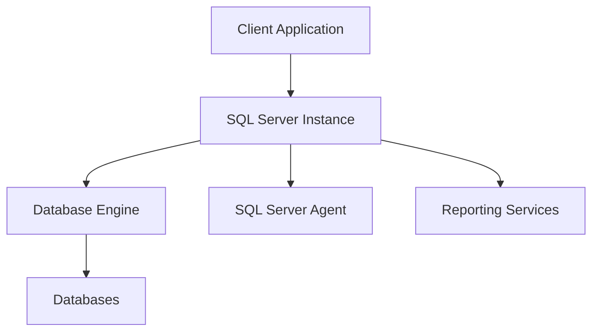
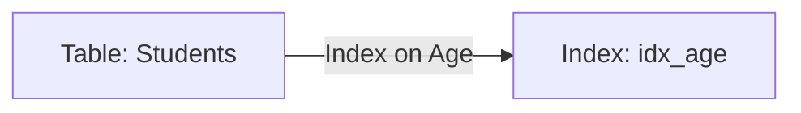
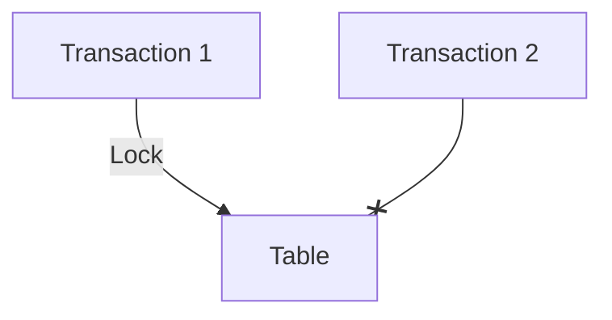
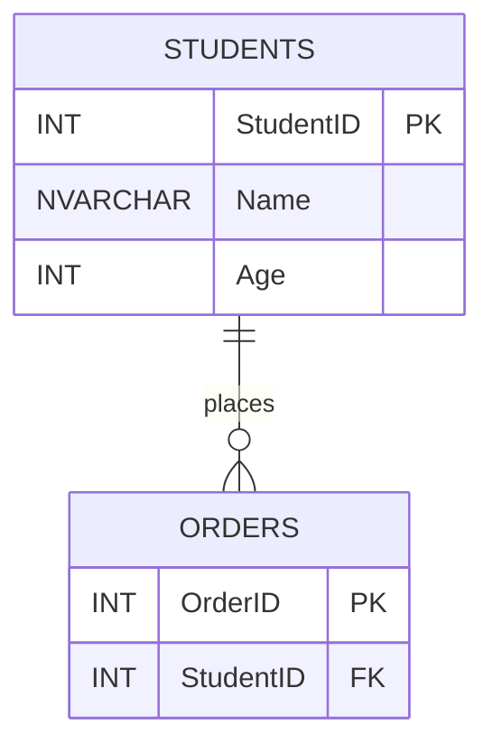

# General Topics Related to Microsoft SQL Server and SQL Queries for Entry-Level Technical Interviews (Expanded)

This document offers a comprehensive overview of Microsoft SQL Server topics, including SQL query writing, conceptual explanations, diagrams, and practical examples. It is designed to prepare entry-level developers for technical interviews.

---

## Table of Contents

1. [Introduction to Microsoft SQL Server](#introduction-to-microsoft-sql-server)
2. [SQL Server Architecture](#sql-server-architecture)
3. [Databases, Tables, and Schemas](#databases-tables-and-schemas)
4. [SQL Data Types](#sql-data-types)
5. [Basic SQL Queries](#basic-sql-queries)
6. [Filtering, Sorting, and Grouping](#filtering-sorting-and-grouping)
7. [Joins in SQL](#joins-in-sql)
8. [Subqueries and Nested Queries](#subqueries-and-nested-queries)
9. [SQL Functions and Expressions](#sql-functions-and-expressions)
10. [Indexes and Keys](#indexes-and-keys)
11. [Stored Procedures and Functions](#stored-procedures-and-functions)
12. [Transactions and Locking](#transactions-and-locking)
13. [Normalization and Database Design](#normalization-and-database-design)
14. [Common SQL Server Tools](#common-sql-server-tools)
15. [Frequently Asked Interview Questions](#frequently-asked-interview-questions)
16. [Resources for Further Study](#resources-for-further-study)

---

## 1. Introduction to Microsoft SQL Server

**Microsoft SQL Server** is a relational database management system (RDBMS) developed by Microsoft. It is widely used in enterprise environments for storing, processing, and securing data.

### Key Features

- ACID compliant transactions
- High availability and disaster recovery
- Advanced security features
- Integration with .NET applications
- Tools for administration, reporting, and analysis

---

## 2. SQL Server Architecture

SQL Server architecture consists of several components:



**Components:**
- **Database Engine:** Core service for storing, processing, and securing data.
- **SQL Server Agent:** Schedules and executes jobs like backups or maintenance.
- **Reporting Services:** Generates reports from SQL Server data.
- **Integration Services:** ETL (Extract, Transform, Load) operations.

---

## 3. Databases, Tables, and Schemas

- **Database:** Collection of tables, views, and other objects.
- **Table:** Stores data in rows and columns.
- **Schema:** Logical container for database objects.

```sql
-- Creating a database
CREATE DATABASE SchoolDB;

-- Creating a table
CREATE TABLE Students (
    StudentID INT PRIMARY KEY,
    Name NVARCHAR(100),
    Age INT,
    EnrollmentDate DATE
);

-- Using schemas
CREATE SCHEMA School;
CREATE TABLE School.Teachers (
    TeacherID INT PRIMARY KEY,
    Name NVARCHAR(100)
);
```

---

## 4. SQL Data Types

| Data Type      | Example        | Description                |
|----------------|---------------|----------------------------|
| INT            | 123           | Whole numbers              |
| DECIMAL        | 123.45        | Fixed precision numbers    |
| FLOAT          | 123.4567      | Floating point numbers     |
| NVARCHAR(n)    | 'John Doe'    | Unicode text               |
| DATE           | '2025-01-01'  | Date only                  |
| DATETIME       | '2025-01-01 08:00:00' | Date and time         |

---

## 5. Basic SQL Queries

### SELECT Statement

```sql
SELECT Name, Age FROM Students;
```

### INSERT Statement

```sql
INSERT INTO Students (StudentID, Name, Age, EnrollmentDate)
VALUES (1, 'Alice', 20, '2025-08-01');
```

### UPDATE Statement

```sql
UPDATE Students
SET Age = 21
WHERE StudentID = 1;
```

### DELETE Statement

```sql
DELETE FROM Students
WHERE StudentID = 1;
```

---

## 6. Filtering, Sorting, and Grouping

### WHERE Clause

```sql
SELECT * FROM Students WHERE Age > 18;
```

### ORDER BY Clause

```sql
SELECT * FROM Students ORDER BY Age DESC;
```

### GROUP BY Clause

```sql
SELECT Age, COUNT(*) AS NumStudents
FROM Students
GROUP BY Age;
```

---

## 7. Joins in SQL

Joins combine rows from two or more tables, based on related columns.

| Join Type   | Description           | Example Syntax          |
|-------------|----------------------|------------------------|
| INNER JOIN  | Matches both tables   | ... INNER JOIN ... ON ... |
| LEFT JOIN   | All rows from left    | ... LEFT JOIN ... ON ... |
| RIGHT JOIN  | All rows from right   | ... RIGHT JOIN ... ON ... |
| FULL JOIN   | All rows from both    | ... FULL JOIN ... ON ... |

### Join Diagram

```mermaid
venn
    title SQL Join Types
    A[Table A]
    B[Table B]
    A & B[INNER JOIN]
    A[LEFT JOIN]
    B[RIGHT JOIN]
    A & B[FULL JOIN]
```

### Example

```sql
SELECT s.Name, t.Name AS Teacher
FROM Students s
INNER JOIN School.Teachers t
    ON s.StudentID = t.TeacherID;
```

---

## 8. Subqueries and Nested Queries

Subqueries allow queries within queries.

### Example

```sql
SELECT Name
FROM Students
WHERE Age = (SELECT MAX(Age) FROM Students);
```

### Correlated Subquery

```sql
SELECT Name, Age
FROM Students s
WHERE Age > (SELECT AVG(Age) FROM Students WHERE EnrollmentDate < s.EnrollmentDate);
```

---

## 9. SQL Functions and Expressions

| Function     | Example                  | Description                   |
|--------------|--------------------------|-------------------------------|
| COUNT(*)     | SELECT COUNT(*) FROM ... | Counts rows                   |
| SUM()        | SELECT SUM(Age) FROM ... | Sums values                   |
| AVG()        | SELECT AVG(Age) FROM ... | Averages values               |
| MIN()        | SELECT MIN(Age) FROM ... | Minimum value                 |
| MAX()        | SELECT MAX(Age) FROM ... | Maximum value                 |
| GETDATE()    | SELECT GETDATE()         | Current date and time         |
| LEN()        | SELECT LEN(Name) FROM ...| Length of a string            |

---

## 10. Indexes and Keys

- **Primary Key:** Uniquely identifies each row.
- **Foreign Key:** Links rows to another table.
- **Index:** Improves query performance.

### Example

```sql
CREATE TABLE Orders (
    OrderID INT PRIMARY KEY,
    StudentID INT,
    FOREIGN KEY (StudentID) REFERENCES Students(StudentID)
);

CREATE INDEX idx_age ON Students(Age);
```

### Index Diagram



---

## 11. Stored Procedures and Functions

**Stored Procedures:** Predefined SQL code that can be reused.

```sql
CREATE PROCEDURE GetStudentByID
    @StudentID INT
AS
BEGIN
    SELECT * FROM Students WHERE StudentID = @StudentID;
END
```

**Functions:** Return a value and can be used in queries.

```sql
CREATE FUNCTION GetStudentAge(@StudentID INT)
RETURNS INT
AS
BEGIN
    DECLARE @Age INT;
    SELECT @Age = Age FROM Students WHERE StudentID = @StudentID;
    RETURN @Age;
END
```

---

## 12. Transactions and Locking

### Transaction Example

```sql
BEGIN TRANSACTION;
UPDATE Students SET Age = Age + 1 WHERE StudentID = 1;
COMMIT TRANSACTION;
```

**ACID Properties:**

| Property      | Description                |
|---------------|---------------------------|
| Atomicity     | All or nothing             |
| Consistency   | Maintains valid state      |
| Isolation     | Transactions are independent|
| Durability    | Changes are permanent      |

### Locking Diagram



---

## 13. Normalization and Database Design

### Normalization

| Normal Form | Principle                          | Example                      |
|-------------|------------------------------------|------------------------------|
| 1NF         | Eliminate repeating groups         | Each column = atomic value   |
| 2NF         | Remove partial dependencies        | No partial key dependency    |
| 3NF         | Remove transitive dependencies     | No non-key dependency        |

### Entity-Relationship Diagram



---

## 14. Common SQL Server Tools

- **SQL Server Management Studio (SSMS):** GUI for managing SQL Server.
- **Azure Data Studio:** Cross-platform management tool.
- **SQLCMD:** Command-line utility for running queries.

---

## 15. Frequently Asked Interview Questions

1. What is the difference between a primary key and a foreign key?
2. How do you write a SQL query to find duplicate records?
3. Explain the concept of normalization.
4. What does ACID stand for, and why is it important?
5. How do you retrieve the top 5 rows from a table?
6. What is an index, and how does it improve performance?
7. How can you join two tables to get matching records?
8. What is a stored procedure, and how is it different from a function?
9. How do you handle transactions in SQL Server?
10. How do you filter and sort results in a query?

---

## 16. Resources for Further Study

- [Microsoft SQL Server Docs](https://learn.microsoft.com/en-us/sql/)
- [SQL Tutorial - W3Schools](https://www.w3schools.com/sql/)
- [SQL Server Management Studio](https://learn.microsoft.com/en-us/sql/ssms/)
- [Azure Data Studio](https://learn.microsoft.com/en-us/sql/azure-data-studio/)
- [Sample Databases](https://github.com/microsoft/sql-server-samples)

---

> **Tip:** For interviews, practice writing queries, drawing ER diagrams, and explaining database design principles. Build sample databases, experiment with SSMS, and review sample questions.

---

This expanded document is a master reference for Microsoft SQL Server and SQL query interview preparation. It includes practical examples, diagrams, and charts for enhanced learning.