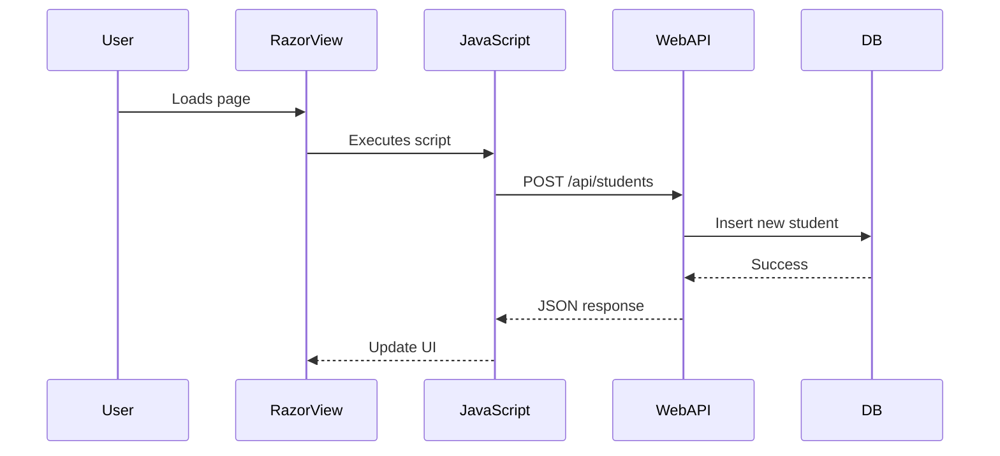

# General Topics Related to Razor with .NET MVC Web API Backend for Entry-Level Technical Interviews (Expanded)

This document provides a comprehensive overview of using Razor as a frontend view engine with a .NET MVC Web API backend. It includes conceptual explanations, code samples, diagrams, integration scenarios, and common interview questions to help entry-level developers prepare for technical interviews.

---

## Table of Contents

1. [Introduction to Razor and .NET MVC Web API](#introduction-to-razor-and-net-mvc-web-api)
2. [Architecture Overview](#architecture-overview)
3. [Setting Up the .NET MVC Web API](#setting-up-the-net-mvc-web-api)
4. [Developing Razor Views](#developing-razor-views)
5. [Client-Server Communication: AJAX and Fetch](#client-server-communication-ajax-and-fetch)
6. [CRUD Operations Example](#crud-operations-example)
7. [Authentication and Security](#authentication-and-security)
8. [Common Integration Challenges](#common-integration-challenges)
9. [Testing and Debugging](#testing-and-debugging)
10. [Frequently Asked Interview Questions](#frequently-asked-interview-questions)
11. [Diagrams and Visual Summaries](#diagrams-and-visual-summaries)
12. [Resources for Further Study](#resources-for-further-study)

---

## 1. Introduction to Razor and .NET MVC Web API

- **Razor:** A markup syntax for embedding server-based code into web pages, used in ASP.NET MVC/ASP.NET Core for generating dynamic HTML. Razor files have a `.cshtml` extension.
- **.NET MVC Web API:** A backend framework for creating RESTful APIs in ASP.NET MVC, typically returning JSON data for frontend applications.

**Why Use Them Together?**
- Razor provides rich server-side rendering with easy integration of C# logic.
- .NET Web API delivers data via AJAX, enabling dynamic content updates in Razor views.
- Modern applications often use Razor for initial page rendering and AJAX for interactive updates.

---

## 2. Architecture Overview

```mermaid
flowchart LR
    A[Browser: Razor View (.cshtml)] -- AJAX/Fetch --> B[.NET MVC Web API]
    B -- Data (JSON) --> A
    B -- DB Access --> C[SQL Server/Database]
```

**Explanation:**  
Razor views are rendered on the server, served to the browser, and can use JavaScript (AJAX/Fetch) to communicate with the Web API for dynamic updates.

---

## 3. Setting Up the .NET MVC Web API

**Basic Steps:**
1. Create an ASP.NET Web API project.
2. Define Model classes, Controllers, and DbContext (if using Entity Framework).
3. Implement RESTful endpoints in controllers.

**Sample Controller:**
```csharp
[RoutePrefix("api/students")]
public class StudentsController : ApiController
{
    [HttpGet]
    [Route("")]
    public IEnumerable<Student> GetAll()
    {
        return db.Students.ToList();
    }

    [HttpPost]
    [Route("")]
    public IHttpActionResult Create(Student student)
    {
        db.Students.Add(student);
        db.SaveChanges();
        return Ok(student);
    }
}
```

---

## 4. Developing Razor Views

**App Structure:**
- Views are `.cshtml` files using Razor syntax.
- Controllers pass models to views for rendering.
- Views may include JavaScript for AJAX-based interaction with Web API.

**Sample Razor View (Index.cshtml):**
```cshtml
@model IEnumerable<Student>
@{
    ViewBag.Title = "Students";
}
<h2>Students</h2>
<ul id="studentList">
@foreach (var student in Model)
{
    <li>@student.Name</li>
}
</ul>

<input id="newStudentName" placeholder="Name" />
<button id="addStudentBtn">Add Student</button>

@section Scripts {
<script>
document.getElementById('addStudentBtn').onclick = function() {
    var name = document.getElementById('newStudentName').value;
    fetch('/api/students', {
        method: 'POST',
        headers: {'Content-Type': 'application/json'},
        body: JSON.stringify({name: name})
    })
    .then(res => res.json())
    .then(student => {
        var li = document.createElement('li');
        li.textContent = student.name;
        document.getElementById('studentList').appendChild(li);
    });
};
</script>
}
```

---

## 5. Client-Server Communication: AJAX and Fetch

- Use JavaScript's `fetch` or jQuery AJAX to call Web API endpoints.
- Web API endpoints return JSON responses.
- Typical HTTP verbs: GET, POST, PUT, DELETE for CRUD operations.

| Method      | HTTP Verb | Purpose                  |
|-------------|-----------|--------------------------|
| fetch/get   | GET       | Fetch data               |
| fetch/post  | POST      | Create data              |
| fetch/put   | PUT       | Update data              |
| fetch/delete| DELETE    | Remove data              |

**Sample AJAX Example with jQuery:**
```javascript
$.get('/api/students', function(data) { /* update UI */ });
```

---

## 6. CRUD Operations Example

**Backend (C# Web API Controller):**
```csharp
[HttpPut]
[Route("{id}")]
public IHttpActionResult Update(int id, Student student)
{
    var existing = db.Students.Find(id);
    if (existing == null) return NotFound();
    existing.Name = student.Name;
    db.SaveChanges();
    return Ok(existing);
}

[HttpDelete]
[Route("{id}")]
public IHttpActionResult Delete(int id)
{
    var student = db.Students.Find(id);
    if (student == null) return NotFound();
    db.Students.Remove(student);
    db.SaveChanges();
    return Ok();
}
```

**Frontend (Razor View with JavaScript):**
```cshtml
<script>
function updateStudent(id, name) {
    fetch(`/api/students/${id}`, {
        method: 'PUT',
        headers: {'Content-Type': 'application/json'},
        body: JSON.stringify({ name: name })
    }).then(res => res.json())
      .then(updated => {/* update UI */});
}
function deleteStudent(id) {
    fetch(`/api/students/${id}`, {
        method: 'DELETE'
    }).then(() => {/* update UI */});
}
</script>
```

---

## 7. Authentication and Security

- **Web API** can implement authentication (JWT, OAuth, cookie-based).
- **Razor Views** can access authentication state server-side and pass tokens to JavaScript if needed.
- **CORS (Cross-Origin Resource Sharing):** Enable in Web API if AJAX requests come from another domain.

**Sample JWT Token Usage in AJAX:**
```javascript
fetch('/api/students', {
    headers: { 'Authorization': 'Bearer ' + token }
});
```

**Enable CORS in .NET Web API:**
```csharp
public static void Register(HttpConfiguration config)
{
    config.EnableCors();
}
```

---

## 8. Common Integration Challenges

| Challenge                | Solution                                   |
|--------------------------|--------------------------------------------|
| CORS errors              | Enable CORS in Web API                     |
| Serialization issues     | Ensure models are serializable             |
| Route mismatches         | Match AJAX URLs to Web API endpoints       |
| Large payloads           | Use paging or filtering                    |
| Error handling           | Return meaningful errors from API, handle errors in JavaScript |

---

## 9. Testing and Debugging

- **Backend:** Use Postman or Swagger to test API endpoints.
- **Frontend:** Use browser DevTools to inspect AJAX requests and JavaScript errors.
- **Unit Testing:** Xunit/NUnit for .NET, QUnit/Jasmine for JavaScript.
- **Debugging:** Check network activity, error messages, and server logs.

---

## 10. Frequently Asked Interview Questions

1. How do Razor views interact with a .NET Web API backend?
2. What is the role of Razor in ASP.NET MVC?
3. How do you perform AJAX-based CRUD operations in Razor views?
4. How is authentication handled between Razor and Web API?
5. What are common integration issues and how do you solve them?
6. How do you pass data from server-side Razor to client-side JavaScript?
7. How do you handle errors in AJAX calls in Razor views?
8. What is CORS and why is it important?
9. How do you test Razor views and Web API endpoints?
10. How do you structure a Razor view for dynamic content updates?

---

## 11. Diagrams and Visual Summaries

### Full Stack Request Flow



### Razor View Component Interaction

```mermaid
flowchart TD
    A[Razor (.cshtml)] --> B[JavaScript Function]
    B --> C[AJAX/Fetch]
    C --> D[WebAPI Endpoint]
```

---

## 12. Resources for Further Study

- [Razor View Engine Documentation](https://learn.microsoft.com/en-us/aspnet/core/mvc/views/razor)
- [ASP.NET Web API Documentation](https://learn.microsoft.com/en-us/aspnet/web-api/)
- [Microsoft Tutorial: AJAX in ASP.NET MVC](https://learn.microsoft.com/en-us/aspnet/core/mvc/controllers/ajax)
- [Postman API Testing Tool](https://www.postman.com/)
- [Swagger for Web API](https://swagger.io/)

---

> **Tip:** For interviews, be ready to write Razor markup, JavaScript AJAX code, and Web API endpoints. Explain how data flows from backend to frontend and how you handle dynamic updates and errors.

---

This expanded document is a master reference for Razor and .NET MVC Web API integration interview preparation, including conceptual explanations, code samples, diagrams, and common questions for entry-level developers.