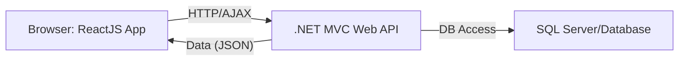
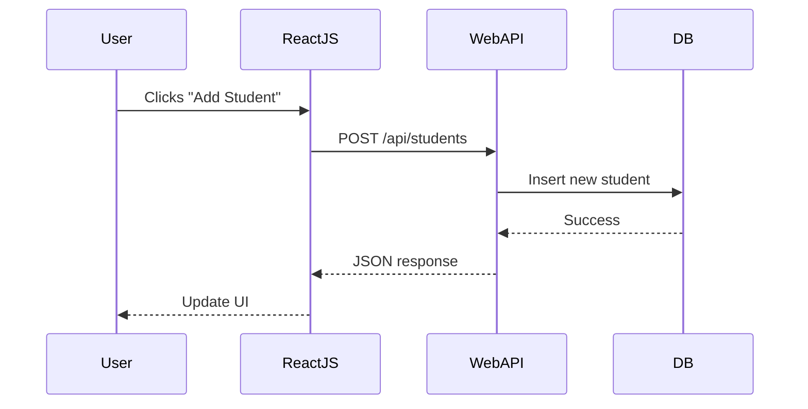
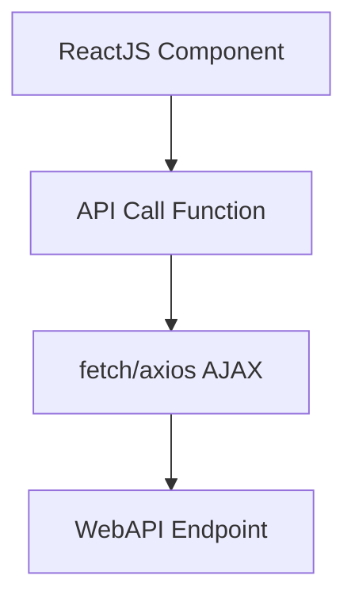

# General Topics Related to ReactJS with .NET MVC Web API Backend for Entry-Level Technical Interviews (Expanded)

This document provides a comprehensive overview of using ReactJS as a frontend framework with a .NET MVC Web API backend. It includes conceptual explanations, code samples, diagrams, integration scenarios, and common interview questions to help entry-level developers prepare for technical interviews.

---

## Table of Contents

1. [Introduction to ReactJS and .NET MVC Web API](#introduction-to-reactjs-and-net-mvc-web-api)
2. [Architecture Overview](#architecture-overview)
3. [Setting Up the .NET MVC Web API](#setting-up-the-net-mvc-web-api)
4. [Developing the ReactJS Frontend](#developing-the-reactjs-frontend)
5. [Client-Server Communication with Fetch and Axios](#client-server-communication-with-fetch-and-axios)
6. [CRUD Operations Example](#crud-operations-example)
7. [Authentication and Security](#authentication-and-security)
8. [Common Integration Challenges](#common-integration-challenges)
9. [Testing and Debugging](#testing-and-debugging)
10. [Frequently Asked Interview Questions](#frequently-asked-interview-questions)
11. [Diagrams and Visual Summaries](#diagrams-and-visual-summaries)
12. [Resources for Further Study](#resources-for-further-study)

---

## 1. Introduction to ReactJS and .NET MVC Web API

- **ReactJS:** A popular JavaScript library for building user interfaces, especially single-page applications (SPAs). Uses reusable components, state management, and a virtual DOM for efficient updates.
- **.NET MVC Web API:** A backend framework for creating RESTful APIs in ASP.NET MVC, typically returning JSON data for frontend applications.

**Why Use Them Together?**
- Clean separation between UI and backend logic.
- Scalable, maintainable stack for modern web applications.
- ReactJS efficiently manages the frontend, and Web API handles data and business logic.

---

## 2. Architecture Overview



**Explanation:**  
ReactJS runs in the user's browser, sending HTTP requests to the .NET Web API.  
Web API processes requests, interacts with the database, and returns JSON responses.

---

## 3. Setting Up the .NET MVC Web API

**Basic Steps:**
1. Create an ASP.NET Web API project.
2. Define Model classes, Controllers, and DbContext (if using Entity Framework).
3. Implement RESTful endpoints in controllers.

**Sample Controller:**
```csharp
[RoutePrefix("api/students")]
public class StudentsController : ApiController
{
    [HttpGet]
    [Route("")]
    public IEnumerable<Student> GetAll()
    {
        return db.Students.ToList();
    }

    [HttpPost]
    [Route("")]
    public IHttpActionResult Create(Student student)
    {
        db.Students.Add(student);
        db.SaveChanges();
        return Ok(student);
    }
}
```

---

## 4. Developing the ReactJS Frontend

**App Structure:**
- Components for UI pieces (StudentList, AddStudent, etc.)
- State management with useState/useReducer or context
- Functions for API communication

**Sample React Component:**
```jsx
import React, { useState, useEffect } from 'react';

function StudentList() {
  const [students, setStudents] = useState([]);
  const [newStudent, setNewStudent] = useState("");

  useEffect(() => {
    fetch('/api/students')
      .then(res => res.json())
      .then(data => setStudents(data));
  }, []);

  function addStudent() {
    fetch('/api/students', {
      method: 'POST',
      headers: {'Content-Type': 'application/json'},
      body: JSON.stringify({name: newStudent})
    })
    .then(res => res.json())
    .then(student => setStudents(students => [...students, student]));
  }

  return (
    <div>
      <ul>
        {students.map(s => <li key={s.studentId}>{s.name}</li>)}
      </ul>
      <input value={newStudent} onChange={e => setNewStudent(e.target.value)} placeholder="Name" />
      <button onClick={addStudent}>Add Student</button>
    </div>
  );
}
```

---

## 5. Client-Server Communication with Fetch and Axios

- ReactJS typically uses `fetch` or `axios` for AJAX requests.
- Web API endpoints respond with JSON.
- Use HTTP verbs: GET, POST, PUT, DELETE for CRUD.

| Method   | HTTP Verb | Purpose                  |
|----------|-----------|--------------------------|
| fetch/axios.get    | GET       | Fetch data               |
| fetch/axios.post   | POST      | Create data              |
| fetch/axios.put    | PUT       | Update data              |
| fetch/axios.delete | DELETE    | Remove data              |

**Sample Axios Example:**
```javascript
import axios from 'axios';
axios.get('/api/students').then(res => setStudents(res.data));
```

---

## 6. CRUD Operations Example

**Backend (C# Web API Controller):**
```csharp
[HttpPut]
[Route("{id}")]
public IHttpActionResult Update(int id, Student student)
{
    var existing = db.Students.Find(id);
    if (existing == null) return NotFound();
    existing.Name = student.Name;
    db.SaveChanges();
    return Ok(existing);
}

[HttpDelete]
[Route("{id}")]
public IHttpActionResult Delete(int id)
{
    var student = db.Students.Find(id);
    if (student == null) return NotFound();
    db.Students.Remove(student);
    db.SaveChanges();
    return Ok();
}
```

**Frontend (ReactJS Example):**
```jsx
function updateStudent(id, student) {
  fetch(`/api/students/${id}`, {
    method: 'PUT',
    headers: {'Content-Type': 'application/json'},
    body: JSON.stringify(student)
  })
  .then(res => res.json())
  .then(updated => {/* update state */});
}

function deleteStudent(id) {
  fetch(`/api/students/${id}`, { method: 'DELETE' })
    .then(() => {/* remove from state */});
}
```

---

## 7. Authentication and Security

- **Web API** can implement authentication (JWT, OAuth, cookie-based).
- **ReactJS** stores tokens (JWT) for authenticated requests—commonly in local storage—and sends them in the `Authorization` header.
- **CORS (Cross-Origin Resource Sharing):** If frontend and backend are on different domains, enable CORS in Web API so React can make AJAX requests.

**Sample JWT Token Usage:**
```javascript
fetch('/api/students', {
  headers: { 'Authorization': 'Bearer ' + token }
});
```

**Enable CORS in .NET Web API:**
```csharp
public static void Register(HttpConfiguration config)
{
    config.EnableCors();
}
```

---

## 8. Common Integration Challenges

| Challenge                | Solution                                   |
|--------------------------|--------------------------------------------|
| CORS errors              | Enable CORS in Web API                     |
| Serialization issues     | Ensure models are serializable             |
| Route mismatches         | Match frontend URLs to Web API endpoints   |
| Large payloads           | Use paging or filtering                    |
| Error handling           | Return meaningful errors from API, handle errors in ReactJS |

---

## 9. Testing and Debugging

- **Backend:** Use Postman or Swagger to test API endpoints.
- **Frontend:** Use browser DevTools to inspect network requests.
- **Unit Testing:** Jest/React Testing Library for ReactJS, Xunit/NUnit for .NET.
- **Debugging:** Check network activity, error messages, and server logs.

---

## 10. Frequently Asked Interview Questions

1. How does ReactJS communicate with a .NET Web API backend?
2. What is the role of MVC in .NET Web API?
3. How do you perform CRUD operations using ReactJS and Web API?
4. How is authentication handled between ReactJS and Web API?
5. What are common integration issues and how do you solve them?
6. How do you manage state in ReactJS?
7. How do you handle errors in AJAX calls in ReactJS?
8. What is CORS and why is it important?
9. How do you structure a single-page application in ReactJS?
10. How do you test Web API endpoints and React components?

---

## 11. Diagrams and Visual Summaries

### Full Stack Request Flow



### Component Interaction



---

## 12. Resources for Further Study

- [ReactJS Official Documentation](https://react.dev/)
- [ASP.NET Web API Documentation](https://learn.microsoft.com/en-us/aspnet/web-api/)
- [Microsoft Tutorial: Build a Web App with React and Web API](https://learn.microsoft.com/en-us/aspnet/core/spa/react)
- [Postman API Testing Tool](https://www.postman.com/)
- [Swagger for Web API](https://swagger.io/)
- [Jest Testing Framework](https://jestjs.io/)
- [React Testing Library](https://testing-library.com/docs/react-testing-library/intro/)

---

> **Tip:** For interviews, be ready to write code for both frontend and backend, explain AJAX data flow, and troubleshoot integration issues. Practice setting up a small project and testing end-to-end communication.

---

This expanded document is a master reference for ReactJS and .NET MVC Web API integration interview preparation, including conceptual explanations, code samples, diagrams, and common questions for entry-level developers.