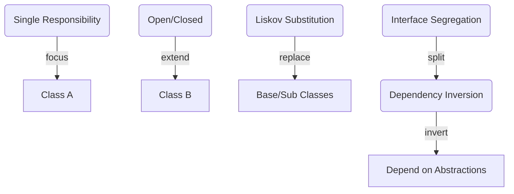
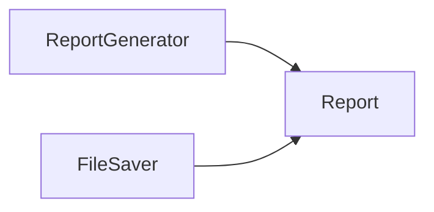

# General Topics Related to SOLID Principles for Entry-Level Technical Interviews (Expanded)

This document provides a comprehensive overview of the SOLID principles of object-oriented design, including conceptual explanations, practical examples, diagrams, and common interview questions relevant for entry-level developers.

---

## Table of Contents

1. [Introduction to SOLID Principles](#introduction-to-solid-principles)
2. [S - Single Responsibility Principle (SRP)](#s---single-responsibility-principle-srp)
3. [O - Open/Closed Principle (OCP)](#o---openclosed-principle-ocp)
4. [L - Liskov Substitution Principle (LSP)](#l---liskov-substitution-principle-lsp)
5. [I - Interface Segregation Principle (ISP)](#i---interface-segregation-principle-isp)
6. [D - Dependency Inversion Principle (DIP)](#d---dependency-inversion-principle-dip)
7. [SOLID in Practice: Example Refactoring](#solid-in-practice-example-refactoring)
8. [Common Interview Questions](#common-interview-questions)
9. [Diagrams and Visual Summaries](#diagrams-and-visual-summaries)
10. [Resources for Further Study](#resources-for-further-study)

---

## 1. Introduction to SOLID Principles

**SOLID** is an acronym representing five core principles of object-oriented programming and design, aimed at writing maintainable, flexible, and robust code.

| Principle | Description                                         |
|-----------|-----------------------------------------------------|
| S         | Single Responsibility Principle                     |
| O         | Open/Closed Principle                               |
| L         | Liskov Substitution Principle                       |
| I         | Interface Segregation Principle                     |
| D         | Dependency Inversion Principle                      |

---

## 2. S - Single Responsibility Principle (SRP)

**Definition:**  
A class should have only one reason to change, meaning it should only have one job or responsibility.

### Example: Violating SRP

```csharp
public class Report
{
    public string GenerateReport() { /* ... */ }
    public void SaveToFile(string content) { /* ... */ }
}
```
*Here, `Report` handles both report generation and file saving.*

### Example: Following SRP

```csharp
public class ReportGenerator
{
    public string GenerateReport() { /* ... */ }
}

public class FileSaver
{
    public void SaveToFile(string content) { /* ... */ }
}
```
*Responsibilities are separated.*

---

## 3. O - Open/Closed Principle (OCP)

**Definition:**  
Software entities (classes, modules, functions) should be open for extension, but closed for modification.

### Example: Violating OCP

```csharp
public class SalaryCalculator
{
    public double CalculateSalary(Employee emp)
    {
        if (emp.Type == "Permanent") return emp.BaseSalary * 1.2;
        else return emp.BaseSalary;
    }
}
```
*Adding new employee types requires modifying the class.*

### Example: Following OCP

```csharp
public abstract class Employee
{
    public abstract double CalculateSalary();
}

public class PermanentEmployee : Employee
{
    public override double CalculateSalary() => baseSalary * 1.2;
}

public class ContractEmployee : Employee
{
    public override double CalculateSalary() => baseSalary;
}
```
*New employee types can be added by extending the base class.*

---

## 4. L - Liskov Substitution Principle (LSP)

**Definition:**  
Objects of a superclass should be replaceable with objects of a subclass without breaking the application.

### Example: Violating LSP

```csharp
public class Bird { public virtual void Fly() { /* ... */ } }
public class Ostrich : Bird { public override void Fly() { throw new Exception("Can't fly"); } }
```
*Substituting `Ostrich` for `Bird` may break client code.*

### Example: Following LSP

```csharp
public interface IFlyable { void Fly(); }

public class Bird : IFlyable { public void Fly() { /* ... */ } }
public class Ostrich { /* ...doesn't implement IFlyable... */ }
```
*Only flying birds implement `IFlyable`.*

---

## 5. I - Interface Segregation Principle (ISP)

**Definition:**  
Clients should not be forced to depend on interfaces they do not use.

### Example: Violating ISP

```csharp
public interface IMachine
{
    void Print();
    void Scan();
    void Fax();
}

public class OldPrinter : IMachine
{
    public void Print() { /* ... */ }
    public void Scan() { throw new NotImplementedException(); }
    public void Fax() { throw new NotImplementedException(); }
}
```
*Clients are forced to implement unused methods.*

### Example: Following ISP

```csharp
public interface IPrinter { void Print(); }
public interface IScanner { void Scan(); }
public interface IFax { void Fax(); }

public class OldPrinter : IPrinter
{
    public void Print() { /* ... */ }
}
```
*Clients implement only what they need.*

---

## 6. D - Dependency Inversion Principle (DIP)

**Definition:**  
High-level modules should not depend on low-level modules. Both should depend on abstractions.

### Example: Violating DIP

```csharp
public class EmailSender
{
    public void SendEmail(string message) { /* ... */ }
}

public class Notification
{
    private EmailSender sender = new EmailSender();
    public void Notify(string msg) { sender.SendEmail(msg); }
}
```
*Notification depends directly on EmailSender.*

### Example: Following DIP

```csharp
public interface IMessageSender
{
    void Send(string message);
}

public class EmailSender : IMessageSender
{
    public void Send(string message) { /* ... */ }
}

public class Notification
{
    private IMessageSender sender;
    public Notification(IMessageSender sender) { this.sender = sender; }
    public void Notify(string msg) { sender.Send(msg); }
}
```
*Notification depends on abstraction, not concrete implementation.*

---

## 7. SOLID in Practice: Example Refactoring

### Before

```csharp
public class Invoice
{
    public void SaveToDB() { /* ... */ }
    public void PrintInvoice() { /* ... */ }
    public void SendEmail() { /* ... */ }
}
```

### After Applying SOLID

```csharp
public class Invoice { /* properties, methods */ }
public class InvoiceRepository { public void SaveToDB(Invoice invoice) { /* ... */ } }
public class InvoicePrinter { public void Print(Invoice invoice) { /* ... */ } }
public class InvoiceMailer { public void SendEmail(Invoice invoice) { /* ... */ } }
```

---

## 8. Common Interview Questions

1. What does each letter in SOLID stand for?
2. Can you give an example of violating the Single Responsibility Principle?
3. How can the Open/Closed Principle help with maintainability?
4. What is the Liskov Substitution Principle and why is it important?
5. How do interface segregation and dependency inversion make code more flexible?
6. Describe a scenario where applying SOLID principles improved your code.
7. How would you refactor a class that does too much?
8. Why is it important to depend on abstractions rather than concrete classes?

---

## 9. Diagrams and Visual Summaries

### SOLID Principles Overview



### SRP Example Breakdown



---

## 10. Resources for Further Study

- [SOLID Principles by Uncle Bob](https://blog.cleancoder.com/)
- [Microsoft Docs: SOLID Design Principles](https://learn.microsoft.com/en-us/dotnet/architecture/modern-web-apps-azure/common-web-application-architectures#solid-principles)
- [SOLID Principles Explained (Dev.to)](https://dev.to/michaelmior/solid-principles-explained-with-examples-3c1g)
- [Pluralsight Course on SOLID](https://www.pluralsight.com/courses/csharp-solid-principles)

---

> **Tip:** For interviews, be ready to explain each principle, spot violations in code, and describe how SOLID leads to better design and maintainability in real-world scenarios.

---

This expanded document is a master reference for SOLID Principles interview preparation, including explanations, code samples, diagrams, and common questions for entry-level developers.